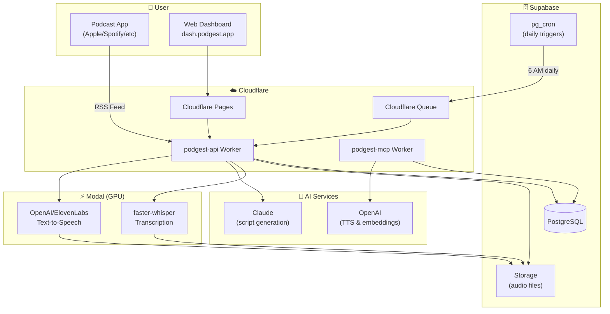

# Podgest

> **Your personal AI podcast digest - delivered daily to your favorite podcast app**

Podgest transforms your podcast subscriptions into personalized daily audio digests. Subscribe to unlimited podcasts, and each morning receive a professionally narrated summary of what matters most - delivered directly to Apple Podcasts, Spotify, or any podcast app via your personal RSS feed.

**Live at [dash.podgest.app](https://dash.podgest.app)**

---

## Architecture



---

## Key Features

| Feature | Description |
|---------|-------------|
| **🎧 Personal RSS Feed** | Subscribe in any podcast app - Apple Podcasts, Spotify, Overcast, etc. |
| **⏱️ Configurable Length** | Choose digest length from 5-20 minutes based on your commute |
| **🕐 Custom Schedule** | Pick your delivery time and timezone (6 AM default) |
| **📡 Any Podcast RSS** | Add any podcast via RSS URL or browse popular feeds |
| **🔗 ListenNotes Integration** | Import your Listen Later playlist - auto-detects individual podcasts |
| **🎯 Smart Prioritization** | Less frequent podcasts (weekly shows) get priority over daily ones |
| **🔐 BYOK (Bring Your Own Keys)** | Use your own OpenAI, Anthropic, and ElevenLabs API keys |
| **🔒 Encrypted Storage** | API keys encrypted at rest with AES-256-GCM |
| **👥 Multi-tenant** | Each user has isolated data and personalized digests |
| **🎙️ MCP Server** | Query your podcast knowledge via Claude Desktop or Cursor |

---

## How It Works

1. **Subscribe** - Add your favorite podcasts via RSS URL in the dashboard
2. **Configure** - Set your preferred digest length (5-20 min), delivery time, and timezone  
3. **Add API Keys** - Provide your OpenAI and Anthropic keys (encrypted and stored securely)
4. **Listen** - Add your personal RSS feed to any podcast app
5. **Enjoy** - Wake up to a personalized audio digest every morning

### Daily Pipeline

```
6:00 AM (your timezone)
    │
    ▼
┌─────────────┐     ┌─────────────┐     ┌─────────────┐
│  Poll RSS   │────▶│ Transcribe  │────▶│  Extract    │
│   Feeds     │     │   (Modal)   │     │   Topics    │
└─────────────┘     └─────────────┘     └─────────────┘
                                               │
    ┌──────────────────────────────────────────┘
    │
    ▼
┌─────────────┐     ┌─────────────┐     ┌─────────────┐
│  Generate   │────▶│  Text-to-   │────▶│  Publish    │
│   Script    │     │   Speech    │     │  to RSS     │
│  (Claude)   │     │ (OpenAI)    │     │             │
└─────────────┘     └─────────────┘     └─────────────┘
```

---

## Tech Stack

| Component | Technology |
|-----------|------------|
| **Frontend** | React + TypeScript + Tailwind (Cloudflare Pages) |
| **API** | Cloudflare Workers (TypeScript) |
| **Database** | Supabase PostgreSQL |
| **Storage** | Supabase Storage (audio files) |
| **Scheduling** | pg_cron + Cloudflare Queues |
| **Transcription** | Modal (faster-whisper on GPU) |
| **Script Generation** | Claude (Anthropic) |
| **Text-to-Speech** | OpenAI TTS (ElevenLabs optional) |
| **Auth** | Supabase Auth (Magic Link) |

---

## Detailed Architecture

### Daily Digest Flow

```
6:00 AM (User's Timezone)
         │
         ▼
┌─────────────────┐     ┌─────────────────┐     ┌─────────────────┐
│   pg_cron       │────▶│  /api/daily-    │────▶│   Poll RSS      │
│ trigger_daily   │     │     cron        │     │   feeds         │
│    _digest()    │     │                 │     │                 │
└─────────────────┘     └─────────────────┘     └────────┬────────┘
                                                         │
         ┌───────────────────────────────────────────────┘
         │
         ▼
┌─────────────────┐     ┌─────────────────┐     ┌─────────────────┐
│  New episodes?  │────▶│ Modal: Transcribe│────▶│  Claude: Extract│
│                 │     │  (GPU)          │     │  topics         │
└─────────────────┘     └─────────────────┘     └────────┬────────┘
                                                         │
         ┌───────────────────────────────────────────────┘
         │
         ▼
┌─────────────────┐     ┌─────────────────┐     ┌─────────────────┐
│  SuperMemory    │────▶│  Claude: Generate│────▶│  Modal: TTS     │
│  embed content  │     │  digest script  │     │  (ElevenLabs)   │
└─────────────────┘     └─────────────────┘     └────────┬────────┘
                                                         │
         ┌───────────────────────────────────────────────┘
         │
         ▼
┌─────────────────┐     ┌─────────────────┐     ┌─────────────────┐
│  Upload to      │────▶│  Update digest  │────▶│   OUTPUT URLs   │
│  Supabase       │     │  record with    │     │                 │
│  Storage        │     │  script_text    │     │                 │
└─────────────────┘     └─────────────────┘     └────────┬────────┘
                                                         │
         ┌───────────────────────────────────────────────┘
         │
         ▼
┌──────────────────────────────────────────────────────────────────┐
│                        CONSUMER ENDPOINTS                         │
│                                                                   │
│  📻 RSS Feed (Spotify/Overcast/Apple Podcasts):                   │
│     https://api.podgest.app/feed/{user_id}.xml    │
│                                                                   │
│  📝 ElevenReader Transcript (overwritten daily):                  │
│     https://api.podgest.app/transcript/latest     │
│     → Returns full script_text as plain text                      │
│     → Always serves the most recent completed digest              │
│                                                                   │
│  🎧 Direct Audio:                                                 │
│     https://...supabase.co/storage/v1/object/public/digests/...  │
└──────────────────────────────────────────────────────────────────┘
```

### Watchdog Pattern (Reliability)

The system has TWO scheduling mechanisms for reliability:

1. **Primary: `daily-digest-6am`** - Runs at 12:00 UTC (6 AM Mexico City)
2. **Backup: `watchdog-hourly`** - Runs at :30 past every hour, checks if today's digest exists, triggers if missing

```sql
-- Watchdog function (simplified)
CREATE FUNCTION watchdog_check_digest() RETURNS jsonb AS $$
BEGIN
  IF NOT EXISTS (SELECT 1 FROM digests WHERE digest_date = CURRENT_DATE) THEN
    -- No digest today - trigger generation via HTTP
    PERFORM net.http_post('https://podgest-api.../api/daily-cron');
    RETURN '{"status": "triggered"}'::jsonb;
  END IF;
  RETURN '{"status": "ok"}'::jsonb;
END;
$$;
```

### Async Queue Architecture (Planned Improvement)

The current synchronous architecture has a fundamental limitation: **Cloudflare Workers timeout after 30 seconds**. When the cron job fires, the worker must poll all RSS feeds, process episodes, and complete digest generation within this window. As the user base grows or feeds become slow, this becomes unreliable.

#### The Problem

```
Current Flow (Synchronous - Fragile):
┌─────────────┐    ┌─────────────────────────────────────────────────────┐
│  pg_cron    │───▶│         Single Worker (30s timeout)                 │
│  fires      │    │  ┌──────────┬──────────┬──────────┬──────────────┐  │
└─────────────┘    │  │ Poll RSS │ Poll RSS │ Poll RSS │ Generate     │  │
                   │  │ Feed 1   │ Feed 2   │ Feed N   │ Digest       │  │
                   │  │ (3s)     │ (5s)     │ (2s)     │ (???)        │  │
                   │  └──────────┴──────────┴──────────┴──────────────┘  │
                   │                                                     │
                   │  ⚠️ If total time > 30s, worker is KILLED           │
                   └─────────────────────────────────────────────────────┘
```

**Failure modes:**
- Slow RSS feeds cause timeout
- Many subscriptions cause timeout
- Network latency causes timeout
- No visibility into where failure occurred

#### The Solution: Cloudflare Queues

```
Async Flow (Queue-Based - Robust):

6:00 AM CDMX
     │
     ▼
┌────────────────┐
│   pg_cron      │
│   fires        │
└───────┬────────┘
        │
        ▼
┌────────────────┐      ┌─────────────────────────────────────────────────┐
│   Dispatcher   │      │              Cloudflare Queue                    │
│   Worker       │─────▶│  ┌─────────┐ ┌─────────┐ ┌─────────┐           │
│   (<1 second)  │      │  │ user_id │ │ user_id │ │ user_id │  ...      │
└────────────────┘      │  │ = abc   │ │ = xyz   │ │ = 123   │           │
        │               │  └─────────┘ └─────────┘ └─────────┘           │
        │               └──────────────────┬──────────────────────────────┘
        │                                  │
        ▼                                  ▼
┌────────────────┐      ┌─────────────────────────────────────────────────┐
│  Returns       │      │          Consumer Worker (per message)           │
│  immediately   │      │                                                  │
│  ✅ No timeout │      │   Each user processed independently:             │
└────────────────┘      │   ┌──────────────────────────────────────────┐  │
                        │   │  1. Poll user's subscriptions (5-10s)    │  │
                        │   │  2. Queue transcription jobs (1s)        │  │
                        │   │  3. Wait for transcription callback      │  │
                        │   │  4. Generate digest (10-15s)             │  │
                        │   │  5. Generate TTS (webhook callback)      │  │
                        │   │  6. Log completion ✅                    │  │
                        │   └──────────────────────────────────────────┘  │
                        │                                                  │
                        │   ⏱️ Each message has own 30s window             │
                        │   🔄 Auto-retry on failure (3 attempts)          │
                        │   📊 Dead-letter queue for debugging             │
                        └──────────────────────────────────────────────────┘
```

#### Benefits

| Aspect | Current (Sync) | Improved (Async) |
|--------|----------------|------------------|
| **Timeout Risk** | High - all work in 30s | Low - work distributed |
| **User Isolation** | None - one slow user blocks all | Full - each user independent |
| **Scalability** | 10-20 users max | 1000s of users |
| **Retry Logic** | Manual watchdog | Built-in per-message |
| **Debugging** | Hard - no visibility | Easy - per-user logs |
| **Parallelism** | None | Automatic |

#### Observability & Logging

Every step writes to `pipeline_logs` with structured data:

```sql
-- Pipeline log entry structure
INSERT INTO pipeline_logs (user_id, event_type, metadata, created_at)
VALUES (
  '97bf7aed-...',
  'queue_message_received',
  '{
    "message_id": "msg_abc123",
    "attempt": 1,
    "stage": "polling",
    "subscriptions_count": 5
  }',
  NOW()
);
```

**Event Types (in order):**

| Event Type | Stage | What It Means |
|------------|-------|---------------|
| `dispatcher_started` | Dispatch | Cron fired, dispatcher running |
| `dispatcher_queued_user` | Dispatch | Message pushed for user |
| `dispatcher_completed` | Dispatch | All messages queued |
| `queue_message_received` | Consumer | Worker picked up message |
| `polling_started` | Polling | Fetching RSS feeds |
| `polling_feed_success` | Polling | Individual feed fetched |
| `polling_feed_error` | Polling | Individual feed failed (includes error) |
| `polling_completed` | Polling | All feeds done, N new episodes |
| `transcription_queued` | Transcription | Modal job started |
| `transcription_callback` | Transcription | Modal returned transcript |
| `digest_generation_started` | Digest | Claude API called |
| `digest_generation_completed` | Digest | Script generated |
| `tts_queued` | TTS | ElevenLabs job started |
| `tts_callback` | TTS | Audio file received |
| `digest_published` | Complete | Audio uploaded, RSS updated |
| `queue_message_failed` | Error | Message failed all retries → DLQ |

**Debugging queries:**

```sql
-- Find where today's digest failed for a user
SELECT event_type, metadata, created_at
FROM pipeline_logs
WHERE user_id = '97bf7aed-...'
  AND created_at > CURRENT_DATE
ORDER BY created_at;

-- Find all failed messages in last 24h
SELECT user_id, metadata->>'error' as error, created_at
FROM pipeline_logs
WHERE event_type = 'queue_message_failed'
  AND created_at > NOW() - INTERVAL '24 hours';

-- Pipeline stage timing analysis
SELECT 
  event_type,
  COUNT(*) as occurrences,
  AVG(EXTRACT(EPOCH FROM (
    LEAD(created_at) OVER (PARTITION BY user_id ORDER BY created_at) - created_at
  ))) as avg_duration_seconds
FROM pipeline_logs
WHERE created_at > CURRENT_DATE
GROUP BY event_type;
```

#### Implementation Components

**1. Cloudflare Queue Setup:**
```toml
# wrangler.toml additions
[[queues.producers]]
queue = "podgest-digest-queue"
binding = "DIGEST_QUEUE"

[[queues.consumers]]
queue = "podgest-digest-queue"
max_batch_size = 1
max_retries = 3
dead_letter_queue = "podgest-digest-dlq"
```

**2. Dispatcher (replaces current cron handler):**
```typescript
async function handleDailyCron(env: Env): Promise<Response> {
  const startTime = Date.now();
  
  // Log dispatcher start
  await logPipelineEvent(env, null, 'dispatcher_started', {
    triggered_at: new Date().toISOString()
  });
  
  // Get all active users
  const { data: users } = await supabase
    .from('profiles')
    .select('id, email, timezone')
    .eq('active', true);
  
  // Queue one message per user
  for (const user of users) {
    await env.DIGEST_QUEUE.send({
      user_id: user.id,
      triggered_at: new Date().toISOString()
    });
    
    await logPipelineEvent(env, user.id, 'dispatcher_queued_user', {
      email: user.email,
      timezone: user.timezone
    });
  }
  
  await logPipelineEvent(env, null, 'dispatcher_completed', {
    users_queued: users.length,
    duration_ms: Date.now() - startTime
  });
  
  return new Response(JSON.stringify({
    status: 'dispatched',
    users: users.length
  }));
}
```

**3. Queue Consumer:**
```typescript
export default {
  async queue(batch: MessageBatch<DigestMessage>, env: Env): Promise<void> {
    for (const message of batch.messages) {
      const { user_id, triggered_at } = message.body;
      
      try {
        await logPipelineEvent(env, user_id, 'queue_message_received', {
          message_id: message.id,
          attempt: message.attempts,
          triggered_at
        });
        
        // Process this user's digest
        await processUserDigest(env, user_id);
        
        message.ack();
      } catch (error) {
        await logPipelineEvent(env, user_id, 'queue_message_error', {
          message_id: message.id,
          attempt: message.attempts,
          error: error.message,
          stack: error.stack
        });
        
        if (message.attempts >= 3) {
          // Will go to dead-letter queue
          await logPipelineEvent(env, user_id, 'queue_message_failed', {
            message_id: message.id,
            final_error: error.message
          });
        }
        
        message.retry();
      }
    }
  }
};
```

#### Watchdog Integration

The watchdog remains as a safety net, but now checks per-user:

```sql
CREATE OR REPLACE FUNCTION watchdog_check_digests()
RETURNS jsonb AS $$
DECLARE
  missing_users jsonb;
BEGIN
  -- Find users who should have a digest today but don't
  SELECT jsonb_agg(jsonb_build_object(
    'user_id', p.id,
    'email', p.email
  ))
  INTO missing_users
  FROM profiles p
  LEFT JOIN digests d ON d.user_id = p.id 
    AND d.digest_date = CURRENT_DATE
    AND d.status = 'completed'
  WHERE p.active = true
    AND d.id IS NULL;
  
  IF missing_users IS NOT NULL THEN
    -- Re-queue missing users
    PERFORM net.http_post(
      'https://podgest-api.../api/requeue-users',
      missing_users,
      '{}'::jsonb,
      '{}'::jsonb
    );
    RETURN jsonb_build_object(
      'status', 'requeued',
      'users', missing_users
    );
  END IF;
  
  RETURN '{"status": "all_complete"}'::jsonb;
END;
$$ LANGUAGE plpgsql;
```

#### Migration Path

1. **Phase A:** Add Cloudflare Queue (no behavior change yet)
2. **Phase B:** Add pipeline_logs events to current sync flow
3. **Phase C:** Deploy dispatcher + consumer (feature-flagged)
4. **Phase D:** Enable for test user, monitor
5. **Phase E:** Enable for all users, disable sync path
6. **Phase F:** Update watchdog to per-user model

---

## Phase 1: Daily Podcast Digest

### 1.1 Podcast Aggregation

| Component | Technology | Purpose |
|-----------|------------|---------|
| **Feed Storage** | Supabase Postgres | User podcast subscriptions |
| **RSS Polling** | Supabase pg_cron | Check feeds every 15 min via Cloudflare Worker |
| **Episode Registry** | Supabase Postgres | Track processed episodes, prevent duplicates |

**Managing Subscriptions:**
- **Phase 1:** Add/edit podcasts directly in the Supabase `subscriptions` table via dashboard
- **Later:** Web UI for subscription management

**Finding RSS URLs:**
- Most podcasts link to their RSS feed on their website
- Or use [getrssfeed.com](https://getrssfeed.com) to find from Apple Podcasts/Spotify links

**Note:** Direct RSS polling with `rss-parser` is simpler and cheaper than ListenNotes API. No external dependencies.

### 1.2 Transcription Pipeline

| Component | Technology | Purpose |
|-----------|------------|---------|
| **Orchestration** | Supabase pg_cron + Webhooks | Cron triggers + webhook callbacks |
| **Compute** | Modal (GPU) | Serverless A10G for Whisper |
| **Model** | `faster-whisper` (base) | Balance of speed and accuracy |
| **Preprocessing** | ffmpeg | Mono, 16kHz, silence removal |
| **Fallback** | Deepgram | Managed transcription if Modal fails |

**Modal Configuration:**

```python
@app.cls(
    gpu="A10G",
    timeout=1800,                # 30 min for long podcasts
    container_idle_timeout=300,  # Keep warm 5 min between jobs
    memory=8192,                 # 8GB RAM
    retries=2,                   # Auto-retry on transient failures
)
class Transcriber:
    @modal.enter()
    def load_model(self):
        # Model loaded once per container, reused across requests
        self.model = WhisperModel("base", device="cuda", compute_type="float16")
    
    @modal.method()
    def transcribe(self, audio_url: str, webhook_url: str, job_id: str):
        # Download, preprocess, transcribe
        result = self._process(audio_url)
        
        # Callback instead of client polling
        requests.post(webhook_url, json={
            "job_id": job_id,
            "status": "completed", 
            "transcript": result
        })
```

**Preprocessing (ffmpeg on Modal, not local):**
```bash
# This runs inside the Modal container, not on your machine
ffmpeg -y -i input.mp3 -ac 1 -ar 16000 -vn \
  -af "silenceremove=start_periods=1:start_duration=0.5:start_threshold=-40dB" \
  output.wav
```

### 1.3 Storage Layer (Tiered)

| Data Type | Storage | Why |
|-----------|---------|-----|
| **Metadata** | Supabase Postgres | Structured queries, RLS, small |
| **Raw transcripts** | Supabase Storage | Large blobs, cheap, signed URLs |
| **Semantic chunks** | SuperMemory (or pgvector) | Embeddings, search, RAG |
| **Generated audio** | Supabase Storage (public) | CDN delivery for podcast RSS |

> ⚠️ **Verify Early (Phase 2):** Confirm SuperMemory supports our filtering needs:
> - Filter by `user_id` (multi-tenancy)
> - Filter by `date_range`
> - Filter by `podcast_name`
> 
> **Fallback options if SuperMemory doesn't fit:**
> - **Supabase pgvector** — Already in our stack, no new service. Requires DIY chunking + embedding (use OpenAI `text-embedding-3-small`). Good enough for our scale.
> - **Pinecone** — Battle-tested, excellent metadata filtering, but adds another service.

**Flow:**

```typescript
// 1. Store raw transcript in Storage
const { data } = await supabase.storage
  .from('transcripts')
  .upload(`${episodeId}.json`, JSON.stringify(transcript));

// 2. Store metadata in Postgres (NOT the full text)
await supabase.from('transcriptions').insert({
  episode_id: episodeId,
  status: 'completed',
  transcript_storage_path: data.path,
  word_count: transcript.text.split(' ').length,
});

// 3. Index in SuperMemory for semantic search
const { id } = await supermemory.add({
  content: transcript.text,
  metadata: {
    episode_id: episodeId,
    podcast: "Acquired",
    title: "NVIDIA Part III",
    date: "2026-01-14",
  }
});

// 4. Store SuperMemory reference
await supabase.from('transcriptions')
  .update({ supermemory_doc_id: id })
  .eq('episode_id', episodeId);
```

### 1.4 Topic Clustering

Since we want auto-clustering by topic for a professional news recap:

**Stage 1: Per-Episode Topic Extraction**
```
For each transcript, extract:
- topic_name: "NVIDIA Earnings", "AI Regulation"
- category: [AI/ML, Business, Technology, Markets, etc.]
- key_points: 2-3 bullets
- notable_quotes: Quotable moments
```

**Stage 2: Cross-Episode Merging**
```
Merge related topics across podcasts:
- "NVIDIA Q4 Earnings" + "Chip Industry Outlook" → "Semiconductor Update"
- Preserve source attribution for each perspective
```

**Stage 3: Script Structure**
```typescript
interface DigestScript {
  intro: string;  // 30 sec
  segments: Array<{
    topic: string;
    duration_target: number;
    sources: Array<{ podcast, episode, perspective }>;
    script: string;
    transition: string;
  }>;
  rapidFire: Array<{  // Quick hits
    headline: string;
    oneLineSummary: string;
    source: string;
  }>;
  outro: string;  // 15 sec
}
```

### 1.5 Audio Generation

> ⚠️ **Critical Clarification:** ElevenReader (elevenreader.io) is a **consumer app** for personal listening. It does NOT expose APIs or RSS feeds. 
>
> For programmatic audio generation, use **ElevenLabs API** (the parent company).

| Component | Technology | Purpose |
|-----------|------------|---------|
| **TTS Engine** | ElevenLabs API | Multi-voice conversation audio |
| **Voice Profile** | Single authoritative voice | Professional news recap style |
| **Post-processing** | ffmpeg (Modal or Edge Function) | Normalize, add intro/outro music |

**Voice Configuration for Professional Recap:**

```typescript
const voiceConfig = {
  voice_id: "pNInz6obpgDQGcFmaJgB",  // "Adam" - deep, professional
  settings: {
    stability: 0.75,
    similarity_boost: 0.75,
    style: 0.0,  // Neutral, not dramatic
    use_speaker_boost: true
  }
};
```

**Script Style Guide:**
- Tone: NPR Morning Edition meets Bloomberg Surveillance
- Language: Clear, precise, avoids jargon
- Attribution: Always credit sources ("According to Ben Gilbert on Acquired...")
- Pacing: Natural pauses between topics

### 1.6 Podcast Distribution

| Component | Technology | Purpose |
|-----------|------------|---------|
| **Audio Storage** | Supabase Storage | Host MP3 files |
| **RSS Generator** | Edge Function | Dynamic podcast RSS feed |
| **CDN** | Supabase CDN | Fast audio delivery |

**RSS Feed Endpoint:** `GET /api/podcast/{user_id}/feed.xml`

```xml
<?xml version="1.0" encoding="UTF-8"?>
<rss version="2.0" xmlns:itunes="...">
  <channel>
    <title>Podgest Daily - {username}</title>
    <description>Your daily podcast digest</description>
    <itunes:image href="https://...cover.jpg"/>
    <item>
      <title>January 14, 2026</title>
      <enclosure url="https://...2026-01-14.mp3" type="audio/mpeg"/>
      <pubDate>Wed, 14 Jan 2026 06:00:00 GMT</pubDate>
      <itunes:duration>30:00</itunes:duration>
    </item>
  </channel>
</rss>
```

**Spotify Submission:**
1. Submit RSS URL via [Spotify for Podcasters](https://podcasters.spotify.com)
2. Set visibility to **"Not searchable"** (can change later)
3. After approval (~24-48 hrs), new episodes appear automatically
4. Only you know the URL — not discoverable in Spotify search

**RSS URL Format:** Use obscure user ID to prevent guessing:
```
https://podgest.yourdomain.com/feed/a8f3b2c9-7d4e-4f1a-9b2c-8e5f3a1d7c6b
```

---

## Phase 2: Interactive Q&A (MCP Server)

### 2.1 MCP Server Architecture

| Component | Technology | Purpose |
|-----------|------------|---------|
| **Runtime** | Cloudflare Workers | Edge-deployed MCP server |
| **Protocol** | MCP over HTTP/SSE | Universal client support |
| **Memory Backend** | SuperMemory API | Semantic search across transcripts |
| **Auth** | OAuth 2.1 + Google | User isolation via Supabase |

### Supported Clients

| Client | Platform | Setup Method |
|--------|----------|--------------|
| **Claude Desktop** | macOS, Windows | `mcp-remote` in config file |
| **Claude Mobile** | iOS, Android | MCP settings in claude.ai account |
| **ChatGPT Desktop** | macOS, Windows | Add connector in Developer Mode |
| **ChatGPT Mobile** | iOS, Android | MCP settings in chatgpt.com account |
| **Cursor** | macOS, Windows, Linux | `.cursor/mcp.json` in project |

**Note:** Mobile apps require configuring MCP servers through the web browser in your account settings (claude.ai or chatgpt.com), then the servers sync to the mobile app.

### 2.2 MCP Tools

```typescript
// Tool 1: Search across all podcast transcripts
{
  name: "search_podcasts",
  description: "Semantic search across all podcast transcripts",
  parameters: {
    query: "string - natural language question",
    date_range: "optional - filter by date",
    podcasts: "optional - filter by podcast name"
  },
  returns: {
    results: [
      {
        podcast: "Acquired",
        episode: "NVIDIA Part III",
        chunk: "Jensen Huang's strategy was to...",  // ~500 words
        relevance_score: 0.92
      }
    ]
  }
}

// Tool 2: Get episode details (metadata + summary, not full transcript)
{
  name: "get_episode",
  description: "Get episode metadata, summary, and link to full transcript",
  parameters: {
    episode_id: "string"
  },
  returns: {
    title: "NVIDIA Part III",
    podcast: "Acquired",
    date: "2026-01-14",
    duration_minutes: 135,
    summary: "Ben and David cover...",
    topics: ["semiconductors", "AI", "data centers"],
    full_transcript_url: "https://..."  // Signed URL, fetch separately if needed
  }
}

// Tool 3: Compare perspectives across podcasts
{
  name: "compare_takes",
  description: "Find how different podcasts covered the same topic",
  parameters: {
    topic: "string",
    date_range: "optional"
  },
  returns: {
    topic: "AI regulation",
    perspectives: [
      { podcast: "All-In", stance: "Against regulation", quote: "..." },
      { podcast: "Hard Fork", stance: "Pro guardrails", quote: "..." }
    ]
  }
}

// Tool 4: Get links to listen to full episode
{
  name: "listen_to_episode",
  description: "Get iOS app deep links + web fallbacks to listen to episode",
  parameters: {
    episode_id: "string"
  },
  returns: {
    episode_id: "abc123",
    podcast_name: "Acquired",
    title: "NVIDIA Part III",
    links: {
      audio_url: "https://...",           // Direct MP3 playback
      spotify_app: "spotify:search:...",  // Opens Spotify app directly (iOS)
      apple_app: "podcasts://search?...", // Opens Apple Podcasts app (iOS)
      spotify_web: "https://open.spotify.com/search/...",  // Web fallback
      apple_web: "https://podcasts.apple.com/search?...",  // Web fallback
      listennotes_url: "https://..."      // ListenNotes page (optional)
    }
  }
}
```

### 2.3 Authentication Flow (Browser-Based OAuth)

MCP supports OAuth 2.0 — **no token copy/paste needed**:

```
┌─────────────────┐                              ┌─────────────────┐
│  Claude Desktop │                              │   MCP Server    │
└────────┬────────┘                              └────────┬────────┘
         │                                                │
         │  1. Connect to MCP server                      │
         │  ─────────────────────────────────────────────▶│
         │                                                │
         │  2. Server requires auth, returns OAuth URL    │
         │  ◀─────────────────────────────────────────────│
         │                                                │
         │  3. Claude opens browser → Google OAuth        │
         │  ────────────────────────────────────────────▶ │
         │                                                │
         │  4. User signs in with Google                  │
         │     Google redirects to MCP server callback    │
         │                                                │
         │  5. MCP server stores session (Supabase Auth)  │
         │     Returns success to Claude                  │
         │  ◀─────────────────────────────────────────────│
         │                                                │
         │  6. MCP connection is now authenticated        │
         │     All subsequent requests use session        │
         │  ◀────────────────────────────────────────────▶│
```

### 2.4 Handling Large Content (No Durable Objects Needed)

**Concern:** Full transcripts could cause timeouts.

**Solution:** MCP tools return **small, fast responses**. Large content stays in Storage:

| MCP Tool | Returns | Size | Latency |
|----------|---------|------|---------|
| `search_podcasts` | SuperMemory chunks (excerpts) | ~500 words each | <1s |
| `get_episode` | Metadata + summary + signed URL | Small | <1s |
| `compare_takes` | Summarized perspectives | Small | <2s |
| `listen_to_episode` | iOS deep links + web URLs | Small | <1s |

**Full transcripts are NOT returned through MCP.** Instead:

```typescript
// get_episode returns a signed URL for the full transcript
{
  title: "NVIDIA Part III",
  podcast: "Acquired",
  summary: "Ben and David cover NVIDIA's data center dominance...",
  relevant_chunks: [...],  // From SuperMemory
  full_transcript_url: "https://xyz.supabase.co/storage/v1/object/sign/..."
}
```

If Claude needs the full transcript, it can fetch from the signed URL directly. This keeps MCP responses fast and avoids Cloudflare Worker timeouts.

---

## Technology Decisions

### Cloud-First Architecture

> ⚠️ **Important:** This project uses **Supabase Cloud exclusively** — no local Docker, no self-hosted Supabase. All processing happens in cloud services, not on your local machine.

| Processing Step | Where It Runs |
|-----------------|---------------|
| Database + Auth + Storage | Supabase Cloud |
| Workflow orchestration | Supabase pg_cron + Webhooks |
| Transcription + ffmpeg | Modal (cloud GPU) |
| Embeddings + search | SuperMemory (cloud) |
| TTS generation | ElevenLabs API |
| MCP server | Cloudflare Workers |
| Web app hosting | Vercel or Cloudflare Pages |

**Your local machine is only for:**
- Writing code
- Running the SvelteKit dev server for UI development
- Deploying to cloud services

### Why These Choices?

| Decision | Rationale |
|----------|-----------|
| **Supabase Cloud** | Managed Postgres, Auth, Storage, Edge Functions — no Docker needed |
| **Supabase pg_cron** | Built-in cron scheduling, watchdog pattern for reliability |
| **Modal** | Serverless GPU; ffmpeg + Whisper run there, not locally |
| **Deepgram as fallback** | Managed transcription if Modal has issues |
| **SuperMemory (or pgvector)** | Managed embeddings + search; verify filtering support early |
| **ElevenLabs API** | Best-in-class TTS |
| **Cloudflare Workers** | Edge-deployed MCP server |
| **Vercel/Cloudflare Pages** | Hosts the SvelteKit app |

### Why NOT These?

| Avoided | Reason |
|---------|--------|
| **Local Supabase (Docker)** | Differences from cloud; we want prod parity from day 1 |
| **Local preprocessing** | Nothing runs on your machine; all cloud |
| **Monolithic Edge Functions** | Timeout limits, hard to debug |
| **Polling for job completion** | Use webhooks instead |
| **Full transcripts in Postgres** | Use object storage |
| **DIY job queue** | Use pg_cron + webhooks |

---

## Design Principles

### Pitfalls to Avoid

Based on experience with similar podcast ingestion systems, here are anti-patterns we're explicitly avoiding:

| Anti-Pattern | Problem | Our Approach |
|--------------|---------|--------------|
| **Monolithic functions** | Timeout limits, one failure breaks chain, hard to debug | Small, focused webhook handlers with isolated failures |
| **Polling for async jobs** | Wastes execution time, risks timeout, orphans jobs | Webhook callbacks from Modal |
| **DIY job queue in DB** | No retries, no dead-letter, race conditions | pg_cron + watchdog pattern for reliability |
| **Full documents in Postgres** | Bloats DB, slows queries | Tiered storage (Postgres → S3 → SuperMemory) |
| **Tight coupling** | One failure cascades, no recovery | Event-driven architecture |
| **GPU workarounds** | CPU fallback is 5-10x slower | Proper GPU config + managed fallback (Deepgram) |

---

## Architecture

### Webhook-Based Pipeline

The system uses a simple, reliable webhook-based architecture with Supabase pg_cron for scheduling:

```
┌─────────────────────────────────────────────────────────────────────────────────┐
│                                    PODGEST                                       │
├─────────────────────────────────────────────────────────────────────────────────┤
│                                                                                  │
│  ┌─────────────────────────────────────────────────────────────────────────────┐│
│  │                      SUPABASE pg_cron (Scheduler)                           ││
│  │  ┌────────────────────┐  ┌────────────────────┐                             ││
│  │  │ daily-digest-6am   │  │ watchdog-hourly    │                             ││
│  │  │ (0 12 * * * UTC)   │  │ (30 * * * * UTC)   │                             ││
│  │  └─────────┬──────────┘  └─────────┬──────────┘                             ││
│  └────────────┼───────────────────────┼────────────────────────────────────────┘│
│               │                       │                                          │
│               └───────────┬───────────┘                                          │
│                           │ HTTP POST                                            │
│                           ▼                                                      │
│  ┌─────────────────────────────────────────────────────────────────────────────┐│
│  │                    CLOUDFLARE WORKER (podgest-api)                          ││
│  │                                                                             ││
│  │   /api/daily-cron ─────┬─────▶ Poll RSS feeds                               ││
│  │                        │       │                                             ││
│  │                        │       ▼                                             ││
│  │                        │   New episodes? ──▶ Trigger Modal transcription    ││
│  │                        │                           │                         ││
│  │                        │                           │ webhook                 ││
│  │                        │                           ▼                         ││
│  │   /api/webhooks/modal ◀────────────────── Transcription complete            ││
│  │         │                                                                    ││
│  │         ▼                                                                    ││
│  │   Extract topics (Claude) ──▶ Embed in SuperMemory                          ││
│  │                        │                                                     ││
│  │                        ▼                                                     ││
│  │                   Check user digest_time                                     ││
│  │                        │                                                     ││
│  │                        ▼                                                     ││
│  │   /api/generate-digest ──▶ Generate script (Claude)                         ││
│  │                              │                                               ││
│  │                              │ HTTP POST                                     ││
│  │                              ▼                                               ││
│  │                         Modal TTS ──▶ ElevenLabs ──▶ Upload audio           ││
│  │                              │                                               ││
│  │                              │ webhook                                       ││
│  │                              ▼                                               ││
│  │   /api/webhooks/tts ◀─── TTS complete, update digest record                 ││
│  │                                                                             ││
│  └─────────────────────────────────────────────────────────────────────────────┘│
│                                                                                  │
│  ┌─────────────────────────────────────────────────────────────────────────────┐│
│  │                              STORAGE LAYER                                  ││
│  ├──────────────────┬───────────────────────┬──────────────────────────────────┤│
│  │ Supabase Postgres│  Supabase Storage     │  SuperMemory                     ││
│  │ - profiles       │  - transcripts/       │  - Semantic chunks               ││
│  │ - episodes       │  - digests/*.mp3      │  - Embeddings                    ││
│  │ - digests        │  - cover.png          │  - Search index                  ││
│  │ - subscriptions  │                       │  - Filtered by user_id           ││
│  │ - transcriptions │                       │                                  ││
│  └──────────────────┴───────────────────────┴──────────────────────────────────┘│
│                                                                                  │
└─────────────────────────────────────────────────────────────────────────────────┘
```

### Why This Architecture?

**Simple & Reliable:**
- No external event bus (removed Inngest dependency)
- Supabase pg_cron is built into our existing database
- Webhooks provide natural async handoffs between services
- Watchdog cron provides automatic retry if primary fails

**Webhook Flow:**
```
pg_cron ──HTTP──▶ Cloudflare Worker ──HTTP──▶ Modal
                        ▲                        │
                        │                        │
                        └────── webhook ─────────┘
```

**Benefits:**
- Each service is stateless and independently scalable
- Failures are isolated (Modal failure doesn't affect RSS polling)
- Easy to debug (every step has HTTP request/response logs)
- Dead-letter handling for permanently failed jobs
- Observability dashboard (see all running/failed jobs)
- Scheduled jobs with timezone support
- No infrastructure to manage

### Why Tiered Storage?

| Data Type | Storage | Reason |
|-----------|---------|--------|
| User profiles, subscriptions | Postgres | Structured, needs RLS, small |
| Episode metadata | Postgres | Query by date, podcast, etc. |
| Full transcripts | Supabase Storage (S3) | Large blobs, cheap storage |
| Semantic chunks | SuperMemory | Search, embeddings, RAG |
| Generated audio | Supabase Storage (public) | CDN delivery for RSS |

### Why Modal with Webhooks?

Instead of polling Modal for job completion (wasteful, timeout-prone), Modal calls us back:

```python
@app.function(gpu="A10G", timeout=900)
def transcribe_audio(audio_url: str, webhook_url: str, job_id: str):
    # Download and transcribe
    result = transcribe(audio_url)
    
    # Call webhook when done
    requests.post(webhook_url, json={
        "job_id": job_id,
        "status": "completed",
        "transcript": result
    })
```

The webhook handler processes the transcription and triggers downstream steps:

```typescript
// /api/webhooks/modal (Cloudflare Worker)
export async function handleModalWebhook(request, env) {
  const { job_id, transcript, status } = await request.json();
  
  // Update transcription record in Supabase
  await updateTranscription(env, job_id, transcript, status);
  
  // Extract topics with Claude
  await extractTopics(env, job_id);
  
  // Embed in SuperMemory
  await embedInSuperMemory(env, job_id);
  
  return new Response(JSON.stringify({ success: true }));
}
```

---

## Database Schema

> **Note:** Job orchestration is handled by **Supabase pg_cron** with a watchdog pattern.
> The primary cron runs at the scheduled time; the watchdog runs hourly to catch any missed runs.

```sql
-- ============================================
-- USERS & AUTH
-- ============================================

CREATE TABLE public.profiles (
  id UUID PRIMARY KEY REFERENCES auth.users(id),
  email TEXT NOT NULL,
  display_name TEXT,
  timezone TEXT DEFAULT 'America/Los_Angeles',
  digest_time TIME DEFAULT '06:00:00',  -- When user wants digest ready
  digest_length_minutes INTEGER DEFAULT 30,
  created_at TIMESTAMPTZ DEFAULT NOW()
);

-- ============================================
-- PODCAST SUBSCRIPTIONS
-- ============================================

CREATE TABLE public.subscriptions (
  id UUID PRIMARY KEY DEFAULT gen_random_uuid(),
  user_id UUID REFERENCES public.profiles(id) ON DELETE CASCADE,
  podcast_title TEXT NOT NULL,
  feed_url TEXT NOT NULL,
  artwork_url TEXT,
  priority INTEGER DEFAULT 5,  -- 1-10, higher = more important for digest
  is_active BOOLEAN DEFAULT true,
  last_polled_at TIMESTAMPTZ,
  created_at TIMESTAMPTZ DEFAULT NOW(),
  UNIQUE(user_id, feed_url)
);

-- ============================================
-- EPISODES (shared across users who subscribe to same podcast)
-- ============================================

CREATE TABLE public.episodes (
  id UUID PRIMARY KEY DEFAULT gen_random_uuid(),
  feed_url TEXT NOT NULL,
  guid TEXT NOT NULL,  -- Unique episode ID from RSS
  title TEXT NOT NULL,
  description TEXT,
  audio_url TEXT NOT NULL,
  published_at TIMESTAMPTZ,
  duration_seconds INTEGER,
  created_at TIMESTAMPTZ DEFAULT NOW(),
  UNIQUE(feed_url, guid)
);

-- ============================================
-- TRANSCRIPTIONS
-- Note: Full transcript stored in Supabase Storage, not here
-- ============================================

CREATE TABLE public.transcriptions (
  id UUID PRIMARY KEY DEFAULT gen_random_uuid(),
  episode_id UUID REFERENCES public.episodes(id) ON DELETE CASCADE UNIQUE,
  status TEXT DEFAULT 'pending',  -- pending, processing, completed, failed
  
  -- Storage references (NOT the actual content)
  transcript_storage_path TEXT,  -- e.g., 'transcripts/{id}.json' in Supabase Storage
  supermemory_doc_id TEXT,       -- Reference to SuperMemory document
  
  -- Metadata (queryable)
  word_count INTEGER,
  language TEXT DEFAULT 'en',
  processing_time_ms INTEGER,
  
  -- Error tracking
  error_message TEXT,
  retry_count INTEGER DEFAULT 0,
  
  created_at TIMESTAMPTZ DEFAULT NOW(),
  completed_at TIMESTAMPTZ
);

-- ============================================
-- TOPIC EXTRACTIONS (per transcription)
-- ============================================

CREATE TABLE public.topic_extractions (
  id UUID PRIMARY KEY DEFAULT gen_random_uuid(),
  transcription_id UUID REFERENCES public.transcriptions(id) ON DELETE CASCADE UNIQUE,
  topics JSONB NOT NULL,  -- [{name, category, key_points, quotes, time_range}]
  created_at TIMESTAMPTZ DEFAULT NOW()
);

-- ============================================
-- DAILY DIGESTS (per-user)
-- ============================================

CREATE TABLE public.digests (
  id UUID PRIMARY KEY DEFAULT gen_random_uuid(),
  user_id UUID REFERENCES public.profiles(id) ON DELETE CASCADE,
  digest_date DATE NOT NULL,
  status TEXT DEFAULT 'pending',  -- pending, generating, completed, failed
  
  -- Topic clustering result
  topic_clusters JSONB,  -- [{topic, sources: [{podcast, episode, perspective}]}]
  
  -- Generated content (stored in Supabase Storage)
  script_storage_path TEXT,     -- 'digests/{id}/script.txt'
  audio_storage_path TEXT,      -- 'digests/{id}/audio.mp3'
  audio_url TEXT,               -- Public CDN URL for RSS feed
  duration_seconds INTEGER,
  
  -- Source tracking
  episodes_included UUID[],
  total_source_minutes INTEGER,
  
  -- Processing metrics
  processing_time_ms INTEGER,
  error_message TEXT,
  
  created_at TIMESTAMPTZ DEFAULT NOW(),
  completed_at TIMESTAMPTZ,
  UNIQUE(user_id, digest_date)
);

-- ============================================
-- MCP TOKENS (for Claude Desktop auth)
-- ============================================

CREATE TABLE public.mcp_tokens (
  id UUID PRIMARY KEY DEFAULT gen_random_uuid(),
  user_id UUID REFERENCES public.profiles(id) ON DELETE CASCADE,
  token_hash TEXT NOT NULL,  -- bcrypt hash, never store plaintext
  name TEXT,                 -- "Claude Desktop - MacBook Pro"
  last_used_at TIMESTAMPTZ,
  expires_at TIMESTAMPTZ,
  created_at TIMESTAMPTZ DEFAULT NOW()
);

-- ============================================
-- EVENT LOG (for debugging/audit, optional)
-- ============================================

CREATE TABLE public.events (
  id UUID PRIMARY KEY DEFAULT gen_random_uuid(),
  event_type TEXT NOT NULL,  -- 'episode.created', 'transcription.completed', etc.
  entity_type TEXT,          -- 'episode', 'transcription', 'digest'
  entity_id UUID,
  user_id UUID REFERENCES public.profiles(id) ON DELETE SET NULL,
  payload JSONB,
  created_at TIMESTAMPTZ DEFAULT NOW()
);

-- Index for querying events by type/entity
CREATE INDEX idx_events_type ON public.events(event_type, created_at DESC);
CREATE INDEX idx_events_entity ON public.events(entity_type, entity_id);

-- ============================================
-- ROW LEVEL SECURITY
-- ============================================

ALTER TABLE public.profiles ENABLE ROW LEVEL SECURITY;
ALTER TABLE public.subscriptions ENABLE ROW LEVEL SECURITY;
ALTER TABLE public.digests ENABLE ROW LEVEL SECURITY;
ALTER TABLE public.mcp_tokens ENABLE ROW LEVEL SECURITY;
ALTER TABLE public.events ENABLE ROW LEVEL SECURITY;

-- Users can only access their own data
CREATE POLICY "Users own their profile" ON public.profiles
  FOR ALL USING (auth.uid() = id);

CREATE POLICY "Users own their subscriptions" ON public.subscriptions
  FOR ALL USING (auth.uid() = user_id);

CREATE POLICY "Users own their digests" ON public.digests
  FOR ALL USING (auth.uid() = user_id);

CREATE POLICY "Users own their tokens" ON public.mcp_tokens
  FOR ALL USING (auth.uid() = user_id);

CREATE POLICY "Users can view their events" ON public.events
  FOR SELECT USING (auth.uid() = user_id);

-- Episodes and transcriptions are shared (accessed via service role in backend)
-- No RLS on episodes/transcriptions - backend uses service role key
```

### Storage Buckets (Supabase Storage)

```sql
-- Create storage buckets
INSERT INTO storage.buckets (id, name, public) VALUES 
  ('transcripts', 'transcripts', false),  -- Private, accessed via signed URLs
  ('digests', 'digests', true);           -- Public, served via CDN for RSS

-- RLS for storage (users can only access their own digest audio)
CREATE POLICY "Public digest access" ON storage.objects
  FOR SELECT USING (bucket_id = 'digests');

CREATE POLICY "Service role transcript access" ON storage.objects
  FOR ALL USING (bucket_id = 'transcripts' AND auth.role() = 'service_role');
```

---

## Pipeline Timing

```
┌─────────────────────────────────────────────────────────────────────┐
│                 DAILY PIPELINE (User TZ: America/Mexico_City)       │
├──────────┬──────────────────────────────────────────────────────────┤
│ Time     │ Stage                                                    │
├──────────┼──────────────────────────────────────────────────────────┤
│ Ongoing  │ RSS Polling - pg_cron calls /api/daily-cron              │
│          │   → Checks for new episodes                              │
│          │   → Triggers Modal transcription for new content         │
│          │   → Claude extracts topics                               │
│          │   → SuperMemory embeds content                           │
│          │                                                          │
│ 6:00 AM  │ ▶ pg_cron triggers digest generation (12:00 UTC)         │
│ 6:00 AM  │   Collect transcripts from past 24-48h                   │
│ 6:00 AM  │   Filter out episodes covered in last 7 days             │
│ 6:01 AM  │   Claude generates 5-min digest script (~750 words)      │
│ 6:02 AM  │   Modal calls ElevenLabs TTS                             │
│ 6:03 AM  │   Audio uploaded to Supabase Storage                     │
│ 6:03 AM  │   Digest record updated with script_text + audio_url     │
│ 6:04 AM  │ ✅ Digest ready in RSS feed + /transcript/latest         │
│          │                                                          │
│ 6:30 AM  │ 🔄 Watchdog cron checks if digest exists (backup)        │
│          │                                                          │
│ 7:00 AM  │ User wakes up, digest in Spotify/Overcast/ElevenReader   │
└──────────┴──────────────────────────────────────────────────────────┘

Note: The 6:00 AM time is configurable per user in the profiles.digest_time column.
Most podcasts release new episodes overnight, so 5-6 AM ensures fresh content.
```

---

## Cost Estimates

### Per-User Monthly Costs

| Service | Tier | Monthly Cost | Notes |
|---------|------|--------------|-------|
| Supabase | Pro (shared) | ~$5 | Amortized across users |
| Modal | Usage | ~$15-25 | ~90 hrs audio/mo @ CPU rates |
| SuperMemory | Pro | ~$6 | 3M tokens shared |
| ElevenLabs | Creator | ~$7 | ~30 min audio/day |
| Claude API | Usage | ~$10 | Summarization + scripts |
| **Total per user** | | **~$43-53/mo** | |

### Platform Fixed Costs

| Service | Tier | Monthly Cost |
|---------|------|--------------|
| Supabase | Pro | $25 |
| Cloudflare Workers | Free | $0 |
| Domain | Annual | ~$1 |
| **Platform total** | | **~$26/mo** |

---

## Project Structure

```
podgest/
├── apps/
│   ├── worker/
│   │   └── podgest-api/              # Main API (Cloudflare Worker)
│   │       ├── src/
│   │       │   └── index.ts          # All endpoints: poll, generate, webhooks, RSS feed
│   │       ├── wrangler.jsonc
│   │       └── package.json
│   │
│   └── mcp-server/                   # MCP Server (Cloudflare Worker)
│       ├── src/
│       │   └── index.ts              # MCP protocol + OAuth + tools
│       ├── wrangler.jsonc
│       └── package.json
│
├── packages/
│   └── core/                         # Shared types and constants
│       ├── src/
│       │   ├── types.ts
│       │   └── constants.ts
│       └── package.json
│
├── modal/
│   ├── transcribe.py                 # Modal transcription endpoint (GPU)
│   ├── audio_utils.py                # ffmpeg preprocessing
│   └── requirements.txt
│
├── supabase/
│   ├── migrations/
│   │   ├── 001_initial_schema.sql
│   │   └── 002_storage_buckets.sql
│   ├── functions/
│   │   └── serve-rss/index.ts        # Simple RSS feed generator (stateless)
│   └── config.toml
│
├── scripts/                          # Dev utilities only (not part of production)
│   ├── test-modal.ts                 # Test Modal endpoint is working
│   └── trigger-digest.ts             # Manually trigger a digest for testing
│
├── .env.example
├── package.json                      # pnpm workspaces
├── pnpm-workspace.yaml
├── turbo.json
└── README.md                         # This file
```

### Key Architectural Patterns

| Concern | Approach |
|---------|----------|
| **Job orchestration** | Supabase pg_cron with watchdog pattern |
| **Async compute** | Modal webhooks (not polling) |
| **Large content** | Supabase Storage for blobs, Postgres for metadata |
| **Search** | SuperMemory for semantic search + embeddings |
| **Retries** | Watchdog cron checks hourly, retriggers if missing |

---

## Implementation Roadmap

### Phase 1: Foundation & Infrastructure
- [x] Initialize monorepo (pnpm + turborepo)
- [x] Set up Supabase project with schema + storage buckets
- [x] Set up Supabase pg_cron for scheduling
- [ ] Implement Google OAuth flow (skipped for now — using magic links)
- [x] Deploy Modal transcription endpoint with proper GPU config
- [x] Add initial podcast subscriptions via Supabase dashboard

### Phase 2: Ingestion Pipeline
- [x] **Verify SuperMemory** supports user_id, date, podcast filtering ✅ (containerTags + metadata filters)
- [x] RSS polling via pg_cron (every 15 min)
- [x] Transcription trigger via Modal webhook
- [x] Modal webhook callback endpoint (`/api/webhooks/modal`)
- [x] `extract-topics` function (Claude Sonnet 4) — auto-triggers after transcription completes
- [x] `embed-content` function (stores in SuperMemory) — auto-triggers after topic extraction
- [x] Deploy API (Cloudflare Workers) for webhook endpoints
- [x] Configure pg_cron jobs in Supabase
- [x] Test full pipeline with 2-3 real podcasts

### Phase 3: Digest Generation ✅
- [x] `generate-digest` endpoint (POST `/api/generate-digest`)
- [x] Script generation with news broadcaster style (Claude Sonnet 4)
- [x] Host persona: Alex Chen, neutral news reader
- [x] Accurate podcast citations (extracts original podcast names from ListenNotes)
- [x] Peter Zeihan content permanently excluded
- [x] ElevenLabs TTS integration (single voice: Eric) via Modal
- [x] Async TTS generation (Worker triggers Modal, returns immediately)
- [x] TTS webhook callback (`/api/webhooks/tts`)
- [x] Store generated audio in Supabase Storage (`digests` bucket)
- [x] Save digest records to database for RSS feed
- [x] Scheduled generation via pg_cron (per-user timezone)
- [x] Free Edge TTS endpoint for testing (`test-audio` bucket)
- [ ] Conversational two-host format (future - requires ElevenLabs enterprise)

### Phase 4: Distribution + MCP ✅
- [x] RSS feed endpoint (`/feed/{userId}`) - Spotify/iTunes compatible
- [x] Upload podcast cover art to Supabase Storage (staging)
- [ ] Submit personal feed to Spotify for Podcasters (waiting for production domain)
- [x] MCP server implementation (Cloudflare Worker) - fully remote, no local proxy
- [x] SuperMemory query integration in MCP tools (`search_podcasts`, `compare_takes`)
- [x] Direct remote MCP connection (no local proxy needed!)
- [x] Cursor project MCP config (`.cursor/mcp.json`)
- [x] Test with Claude Desktop + Cursor
- [x] OAuth authentication flow (see Phase 4.1 below)
- [x] One-time auth CLI for API key generation
- [x] ChatGPT support (desktop + mobile via OAuth 2.1 discovery)

### Phase 4.1: OAuth Authentication (Multi-User Support) ✅

This sub-phase enables proper authentication so multiple users can use Podgest with their own isolated data.

#### Architecture Overview (Fully Remote - No Local Proxy)

```
┌─────────────────────────────────────────────────────────────────────────────┐
│                         ONE-TIME AUTH SETUP                                  │
├─────────────────────────────────────────────────────────────────────────────┤
│                                                                              │
│  1. User runs: node apps/mcp-server/auth-cli/index.js                       │
│                                                                              │
│  2. Browser opens → https://podgest-mcp.../auth                             │
│                           │                                                  │
│                           ▼                                                  │
│  3. Google OAuth → Supabase Auth → Redirect to MCP server /auth/callback    │
│                                          │                                   │
│                                          ▼                                   │
│  4. MCP server generates API key, redirects to localhost:9876/save          │
│                                          │                                   │
│                                          ▼                                   │
│  5. Auth CLI saves key to ~/.podgest/api_key AND updates .cursor/mcp.json   │
│                                                                              │
└─────────────────────────────────────────────────────────────────────────────┘

┌─────────────────────────────────────────────────────────────────────────────┐
│                         RUNTIME (Direct Connection)                          │
├─────────────────────────────────────────────────────────────────────────────┤
│                                                                              │
│  ┌─────────────────┐                         ┌─────────────────────────────┐│
│  │  Cursor / Claude │ ─── HTTPS + API Key ──▶│  Cloudflare Worker          ││
│  │  (no local proxy)│                        │  podgest-mcp.pztest...      ││
│  └─────────────────┘                         └──────────────┬──────────────┘│
│                                                             │               │
│         Authorization: Bearer pk_xxxxx                      │               │
│                                                             ▼               │
│                                              ┌─────────────────────────────┐│
│                                              │  Supabase + SuperMemory     ││
│                                              │  (user_id from API key)     ││
│                                              └─────────────────────────────┘│
└─────────────────────────────────────────────────────────────────────────────┘
```

#### Setup Steps

**Part A: Google Cloud Console** ✅
- [x] A1. Create Google Cloud project (or use existing)
- [x] A2. Configure OAuth consent screen
  - App name: "Podgest"
  - User type: External (for multi-user) or Internal (Google Workspace only)
  - Scopes: `email`, `profile`, `openid`
  - Test users: Add your email (required while in "Testing" status)
- [x] A3. Create OAuth 2.0 Client ID
  - Application type: **Web application**
  - Name: "Podgest Supabase Auth"
  - Authorized redirect URIs: `https://xpviiukiavtpsnafpdmy.supabase.co/auth/v1/callback`
- [x] A4. Copy **Client ID** and **Client Secret**

**Part B: Supabase Auth Configuration** ✅
- [x] B1. Go to Supabase Dashboard → Authentication → Providers → Google
- [x] B2. Enable Google provider
- [x] B3. Paste Google Client ID and Client Secret
- [x] B4. Add to Redirect URLs (Authentication → URL Configuration):
  - `http://localhost:9876/callback` (for local proxy OAuth callback)
- [x] B5. Verify `profiles` table auto-creation trigger exists (or create on first login)

**Part C: Auth CLI + Direct Remote Connection** ✅
- [x] C1. Create one-time auth CLI (`apps/mcp-server/auth-cli/`)
  - Opens browser to `https://podgest-mcp.../auth`
  - Receives API key via localhost:9876 redirect
  - Saves API key to `~/.podgest/api_key`
  - Updates `.cursor/mcp.json` automatically
- [x] C2. Direct remote connection (no local proxy running)
- [x] C3. API keys stored in `mcp_tokens` table (long-lived, no refresh needed)

**Part D: Remote MCP Server Updates** ✅
- [x] D1. Add auth middleware to validate JWT:
  ```typescript
  const { data: { user }, error } = await supabase.auth.getUser(token);
  if (error) return new Response("Unauthorized", { status: 401 });
  const userId = user.id;
  ```
- [x] D2. Pass `userId` to all tool handlers (instead of hardcoded constant)
- [x] D3. Update SuperMemory queries to use `containerTags: [userId]`
- [x] D4. Update Supabase queries to use `user_id=eq.${userId}`
- [x] D5. Handle missing/invalid token gracefully (return helpful error)

**Part E: New User Onboarding Flow** ✅
- [x] E1. User adds `podgest` to Claude Desktop config (or Cursor)
- [x] E2. First MCP request triggers OAuth flow automatically
- [x] E3. Browser opens → Google sign-in → redirect to localhost callback
- [x] E4. Token saved locally, MCP ready to use
- [x] E5. User's profile created in Supabase if first login
- [x] E6. Subsequent sessions reuse saved token (until expiry)

**Part F: Profile Auto-Creation** ✅
- [x] F1. Create Supabase trigger to auto-create profile on first auth:
  ```sql
  CREATE OR REPLACE FUNCTION public.handle_new_user()
  RETURNS TRIGGER AS $$
  BEGIN
    INSERT INTO public.profiles (id, email, display_name, timezone, digest_time)
    VALUES (
      NEW.id,
      NEW.email,
      COALESCE(NEW.raw_user_meta_data->>'full_name', NEW.email),
      'America/Chicago',  -- Default timezone
      '06:00:00'          -- Default digest time
    );
    RETURN NEW;
  END;
  $$ LANGUAGE plpgsql SECURITY DEFINER;

  CREATE TRIGGER on_auth_user_created
    AFTER INSERT ON auth.users
    FOR EACH ROW EXECUTE FUNCTION public.handle_new_user();
  ```

#### Security Considerations

| Concern | Solution |
|---------|----------|
| Token storage | Stored in `~/.podgest/token` with 600 permissions (user-only read/write) |
| Token in URL | Supabase uses fragment (`#access_token=...`) not query param — never sent to server logs |
| Token expiry | Supabase JWTs expire in 1 hour; refresh token flow handles re-auth |
| User isolation | SuperMemory `containerTags` + Supabase RLS enforce data boundaries |
| New user data | New users start with empty subscriptions; admin can seed initial podcasts |

#### Multi-User Data Isolation

| Data Type | Isolation Method |
|-----------|------------------|
| Subscriptions | `user_id` foreign key + RLS |
| Episodes | Shared (no user_id) - all users see same episodes for same podcasts |
| Transcriptions | Shared (linked to episodes) |
| Topic Extractions | Shared (linked to transcriptions) |
| SuperMemory embeddings | `containerTags: [user_id]` filter |
| Digests | `user_id` foreign key + RLS |
| MCP Tokens | `user_id` foreign key + RLS |

#### Testing Checklist
- [x] Fresh user can authenticate via Google
- [x] Token is saved and reused across Claude Desktop restarts
- [x] Expired token triggers re-auth automatically
- [ ] User A cannot see User B's subscriptions or digests (needs second user to test)
- [x] SuperMemory searches are scoped to authenticated user
- [x] New user gets profile auto-created

### Phase 5: Production Deployment & Polish

#### 5.1 Custom Domain Setup
- [ ] Register domain (e.g., `podgest.io` or use subdomain of existing domain)
- [ ] Configure Cloudflare DNS
- [ ] Update Cloudflare Workers with custom domains:
  - `api.podgest.yourdomain.com` → podgest-api worker (RSS, webhooks)
  - `mcp.podgest.yourdomain.com` → podgest-mcp worker
- [ ] Update Supabase Auth redirect URLs to production domain
- [ ] Update Google OAuth authorized redirect URIs
- [ ] Update all hardcoded URLs in codebase

#### 5.2 Spotify Submission
- [ ] Generate podcast cover art (3000x3000px, square)
- [ ] Upload cover art to Supabase Storage (`digests/cover.jpg`)
- [ ] Update RSS feed to include cover art URL
- [ ] Submit RSS feed to Spotify for Podcasters
- [ ] Set visibility to "Not searchable" (private)
- [ ] Wait for approval (24-48 hours)

#### 5.3 Resilience
- [ ] Deepgram fallback if Modal GPU issues persist
- [x] Watchdog cron for automatic retry of missed runs
- [ ] Error notification (email or Slack)

#### 5.4 Observability & Tracing

**Problem:** Logs are currently scattered across 5+ dashboards (Cloudflare, Modal, Supabase, SuperMemory, ElevenLabs). When something fails, it's hard to trace what happened.

**Solution:** Centralized logging with distributed tracing using natural trace IDs.

##### Recommended Stack

| Component | Purpose | Why |
|-----------|---------|-----|
| **Axiom** | Central log aggregation | Free tier, native Cloudflare integration, fast queries |
| **OpenTelemetry** | Distributed tracing | Industry standard, works with Axiom |
| **Sentry** | Error tracking | Automatic error capture, Cloudflare integration |
| **Supabase table** | Cost tracking | Custom `operation_costs` table for per-user billing |

##### Natural Trace IDs

Instead of generating random trace IDs, use the natural identifiers that flow through the system:

| Pipeline | Trace ID | Follows |
|----------|----------|---------|
| **Ingestion** | `episode_id` | RSS poll → transcription → topics → embedding |
| **Digest** | `digest_id` | Trigger → script → TTS → publish |
| **MCP Query** | `request_id` | Auth → tool call → response |

##### Structured Log Schema

All services should emit logs in this format:

```json
{
  "timestamp": "2026-01-16T22:00:00Z",
  "level": "info|warn|error",
  "service": "podgest-api|podgest-mcp|modal-transcribe|modal-tts",
  "trace_id": "episode_id or digest_id",
  "span": "rss_poll|transcription|topic_extraction|embedding|script_gen|tts",
  "user_id": "uuid",
  "event": "started|completed|failed",
  "duration_ms": 1234,
  "metadata": { },
  "cost_usd": 0.05
}
```

##### Ingestion Pipeline Tracing

```
trace_id = episode_id

┌─────────────────────────────────────────────────────────────────────────────┐
│  Episode Lifecycle (single trace)                                           │
├─────────────────────────────────────────────────────────────────────────────┤
│                                                                             │
│  1. rss_poll.episode_found                                                  │
│     └─ feed_url, episode_guid, title                                        │
│                                                                             │
│  2. transcription.started                                                   │
│     └─ modal_job_id, audio_url, audio_duration_estimate                     │
│                                                                             │
│  3. transcription.completed | transcription.failed                          │
│     └─ word_count, language, processing_time_ms, cost_usd                   │
│                                                                             │
│  4. topic_extraction.started                                                │
│     └─ transcript_length                                                    │
│                                                                             │
│  5. topic_extraction.completed                                              │
│     └─ topics_count, themes_count, claude_tokens_used, cost_usd             │
│                                                                             │
│  6. embedding.started                                                       │
│     └─ chunk_count                                                          │
│                                                                             │
│  7. embedding.completed                                                     │
│     └─ supermemory_doc_id, cost_usd                                         │
│                                                                             │
└─────────────────────────────────────────────────────────────────────────────┘
```

##### Digest Pipeline Tracing

```
trace_id = digest_id

┌─────────────────────────────────────────────────────────────────────────────┐
│  Digest Lifecycle (single trace)                                            │
├─────────────────────────────────────────────────────────────────────────────┤
│                                                                             │
│  1. digest.triggered                                                        │
│     └─ user_id, hours_back, eligible_episodes_count                         │
│                                                                             │
│  2. script_generation.started                                               │
│     └─ episode_ids[], target_length_minutes                                 │
│                                                                             │
│  3. script_generation.completed                                             │
│     └─ word_count, topics_covered[], claude_tokens_used, cost_usd           │
│                                                                             │
│  4. tts.started                                                             │
│     └─ modal_job_id, script_length_chars, voice_id                          │
│                                                                             │
│  5. tts.completed | tts.failed                                              │
│     └─ audio_duration_seconds, audio_url, elevenlabs_chars, cost_usd        │
│                                                                             │
│  6. digest.published                                                        │
│     └─ rss_updated, audio_size_bytes                                        │
│                                                                             │
└─────────────────────────────────────────────────────────────────────────────┘
```

##### Cost Tracking Table

```sql
CREATE TABLE public.operation_costs (
  id UUID PRIMARY KEY DEFAULT gen_random_uuid(),
  user_id UUID REFERENCES public.profiles(id),
  trace_id TEXT NOT NULL,           -- episode_id or digest_id
  service TEXT NOT NULL,            -- modal, elevenlabs, claude, supermemory
  operation TEXT NOT NULL,          -- transcription, tts, summarization, embedding
  units_used DECIMAL,               -- seconds, characters, tokens, etc.
  unit_type TEXT,                   -- gpu_seconds, characters, tokens
  cost_usd DECIMAL(10, 6),
  created_at TIMESTAMPTZ DEFAULT NOW()
);

CREATE INDEX idx_costs_user_date ON public.operation_costs(user_id, created_at);
```

##### Alerting Rules

| Alert | Condition | Channel |
|-------|-----------|---------|
| Transcription stuck | No completion webhook > 30 min | Slack/Email |
| TTS failed | Status = failed | Slack/Email |
| Digest not generated | User scheduled time passed, no digest | Slack/Email |
| High cost spike | Daily cost > 2x average | Email |
| Error rate spike | >5% errors in 1 hour | Slack |

##### Implementation Checklist

- [ ] Set up Axiom account and get API key
- [ ] Add Axiom integration to Cloudflare Workers
- [ ] Add structured logging to podgest-api worker
- [ ] Add structured logging to podgest-mcp worker
- [ ] Add logging webhook from Modal to Axiom
- [ ] Create `operation_costs` table in Supabase
- [ ] Add cost logging to each operation
- [ ] Set up Sentry for error tracking
- [ ] Configure alerting rules in Axiom
- [ ] Create cost dashboard (simple Supabase query or Axiom dashboard)

#### 5.5 Documentation
- [ ] User onboarding guide
- [ ] Adding new podcast subscriptions
- [ ] Troubleshooting guide

### Phase 6: Future Enhancements

#### 6.1 Transcription Strategy
Modal-based transcription is the primary (and only) transcription method.

**Cost:** ~$0.05-0.15/episode (GPU time on Modal A10G)

**Why not ListenNotes?**
- PRO tier costs $200/month just for transcript access
- Not cost-effective for personal use (<100 episodes/month)
- Modal is pay-per-use with no monthly commitment

**Optional Future Optimization:**
- Check RSS `<podcast:transcript>` tag first (Podcasting 2.0 standard, ~5% adoption)
- Only fall back to Modal if no transcript in RSS

**ListenNotes FREE tier** (300 req/month) available for:
- Episode search/discovery (enhance MCP)
- Podcast metadata enrichment
- Not used for transcripts

#### 6.2 MCP Enhancements (Completed)
- [x] iOS deep links for Spotify/Apple Podcasts (open apps directly, no browser)
- [x] Accurate podcast name extraction from ListenNotes aggregated feeds
- [x] Direct audio playback URLs
- [ ] Episode chapter markers (if available in RSS)
- [ ] Speaker diarization data (who said what)

#### 6.3 Digest Improvements
- [ ] Configurable digest lengths (5/10/15/30 min presets)
- [ ] Conversational two-host format (requires ElevenLabs enterprise)
- [ ] Topic filtering (e.g., "skip politics today")
- [ ] Priority podcasts get more airtime

#### 6.4 Spotify Integration (OAuth)

Enable users to connect their Spotify account for enhanced personalization and subscription management.

**Core Flow:**
1. User clicks "Connect to Spotify" in Settings UI
2. OAuth 2.0 flow with Spotify (PKCE)
3. Spotify settings panel becomes active (previously greyed out)
4. User can configure Spotify-specific options

**Spotify Settings Panel (unlocked after OAuth):**

| Setting | Description | Default |
|---------|-------------|---------|
| **Display Name Source** | Use Spotify display name for podcast title | Off (use manual name) |
| **Podcast Cover Art** | Use Spotify profile picture as podcast cover | Off (use default Podgest cover) |
| **Import Subscriptions** | One-click import of podcasts user follows on Spotify | Manual trigger |
| **Subscription Suggestions** | Suggest new podcasts based on Spotify listening history | On |

**OAuth Scopes Required:**
```
user-read-private        # Display name, profile picture
user-read-email          # Email (for account matching)
user-library-read        # Followed podcasts (shows)
user-read-playback-position  # Recently played (for suggestions)
```

**Implementation Notes:**
- OAuth tokens stored encrypted in `user_spotify_tokens` table
- Refresh tokens used to maintain connection
- "Disconnect Spotify" option to revoke and clear tokens
- Display name from Spotify is editable (user can override)
- Podcast cover art: resize Spotify profile pic to 3000x3000 or use as-is with fallback

**Database Schema:**
```sql
CREATE TABLE public.user_spotify_tokens (
  id UUID PRIMARY KEY DEFAULT gen_random_uuid(),
  user_id UUID REFERENCES public.profiles(id) ON DELETE CASCADE UNIQUE,
  access_token_encrypted TEXT NOT NULL,
  refresh_token_encrypted TEXT NOT NULL,
  spotify_user_id TEXT NOT NULL,
  spotify_display_name TEXT,
  spotify_email TEXT,
  spotify_profile_image_url TEXT,
  scopes TEXT[],
  expires_at TIMESTAMPTZ NOT NULL,
  created_at TIMESTAMPTZ DEFAULT NOW(),
  updated_at TIMESTAMPTZ DEFAULT NOW()
);
```

**Settings UI Mockup:**
```
┌─────────────────────────────────────────────────────────────┐
│  SPOTIFY INTEGRATION                                         │
├─────────────────────────────────────────────────────────────┤
│                                                              │
│  [🟢 Connected as "Peter Zimmerman"]  [Disconnect]           │
│                                                              │
│  ─────────────────────────────────────────────────────────  │
│                                                              │
│  Podcast Name                                                │
│  ┌─────────────────────────────────────────────────────┐    │
│  │ Peter                                            [✎]│    │
│  └─────────────────────────────────────────────────────┘    │
│  ☑ Use Spotify display name                                  │
│                                                              │
│  ─────────────────────────────────────────────────────────  │
│                                                              │
│  Podcast Cover Art                                           │
│  ┌──────┐                                                    │
│  │ 🎨   │  ○ Default Podgest cover                          │
│  │      │  ● Use my Spotify profile picture                 │
│  └──────┘                                                    │
│                                                              │
│  ─────────────────────────────────────────────────────────  │
│                                                              │
│  Subscription Management                                     │
│                                                              │
│  [Import from Spotify]  Found 12 podcasts you follow         │
│                                                              │
│  ☑ Suggest new podcasts based on my Spotify listening        │
│                                                              │
└─────────────────────────────────────────────────────────────┘
```

**Import Flow:**
1. User clicks "Import from Spotify"
2. Fetch user's followed shows via `GET /me/shows`
3. For each show, attempt to find RSS feed URL:
   - Check if we already have the podcast in our system
   - Use podcast search APIs (ListenNotes, Podcast Index) to find RSS
   - Present list with checkboxes for user to confirm
4. Add selected podcasts to user's subscriptions

**Suggestion Flow:**
1. Periodically fetch user's recently played podcasts
2. Identify podcasts they listen to but haven't subscribed to in Podgest
3. Show as "Suggested" in subscription management UI
4. One-click to add suggested podcast

**Important Limitations:**
- Spotify OAuth does NOT allow programmatic RSS feed submission
- Users must still manually submit their Podgest feed to Spotify for Podcasters
- OAuth is for personalization and subscription sync only

**Checklist:**
- [ ] Register Spotify Developer App (get client ID/secret)
- [ ] Add Spotify OAuth endpoints to `podgest-api`
- [ ] Create `user_spotify_tokens` migration
- [ ] Add "Connect to Spotify" button to Settings UI
- [ ] Implement token encryption/storage
- [ ] Implement token refresh logic
- [ ] Add Spotify settings panel (greyed until connected)
- [ ] Implement display name sync
- [ ] Implement profile picture as cover art option
- [ ] Implement "Import from Spotify" feature
- [ ] Implement subscription suggestions
- [ ] Add "Disconnect Spotify" functionality
- [ ] Test full OAuth flow

---

## Spotify Submission Guide

> **Note:** Wait until production domain is configured before submitting to Spotify. The RSS feed URL is permanent.

### Prerequisites
1. Custom domain configured and working
2. Podcast cover art (3000x3000px square, JPEG/PNG, <500KB)
3. At least one digest episode generated

### RSS Feed URL (Production)
```
https://api.podgest.yourdomain.com/feed/{userId}
```

### Submission Steps

1. **Go to Spotify for Podcasters**
   - https://podcasters.spotify.com
   - Sign in with Spotify account

2. **Add Your Podcast**
   - Click "Get Started" → "I have a podcast"
   - Paste your RSS feed URL

3. **Verify Ownership**
   - Spotify shows preview of your podcast
   - Confirm the details are correct

4. **Fill in Details**
   | Field | Value |
   |-------|-------|
   | Name | Podgest - {Your Name}'s Daily Digest (auto-populated from RSS) |
   | Description | Your personalized daily podcast digest - AI-curated summaries from your favorite shows |
   | Category | News > Daily News |
   | Language | English |
   | Explicit | No |
   
   > **Note:** The podcast name is personalized per user (e.g., "Podgest - Peter's Daily Digest") to ensure uniqueness on Spotify. This is pulled from your display name in Settings, or your Spotify display name if connected.

5. **Set Visibility**
   - Choose **"Not searchable"** to keep it private
   - Only people with the direct link can find it

6. **Submit & Wait**
   - Spotify reviews within 24-48 hours
   - You'll receive email confirmation

### Cover Art Requirements
- **Size:** 3000x3000px (minimum 1400x1400)
- **Format:** JPEG or PNG
- **File size:** Under 500KB
- **Content:** No explicit imagery, readable at small sizes

---

## Design Decisions (Resolved)

| Question | Decision |
|----------|----------|
| **Digest length** | Fixed at 5 minutes for now (Cloudflare Worker limits); configurable preset lengths (5/10/15/30) planned for future |
| **TTS generation** | Modal handles ElevenLabs API calls (no Worker timeout issues) |
| **Podcast priority** | Weighted priorities (1-10) per subscription; higher = more airtime in digest |
| **Skip episodes** | Not for now; may add later |
| **Real-time vs batch** | Batch (overnight) — no real-time digest |
| **Transcript access** | MCP only — no need for transcripts in web UI |
| **Episode deduplication** | Episodes covered in last 7 days are excluded from new digests |
| **ListenNotes feeds** | Original podcast names extracted from episode descriptions for accurate citations |

## Working Endpoints

| Endpoint | Method | Description |
|----------|--------|-------------|
| `/health` | GET | Health check |
| `/api/poll` | POST | Trigger RSS polling for all subscriptions |
| `/api/generate-digest` | POST | Generate a digest (body: `{user_id, hours_back}`) — returns immediately, audio generated async |
| `/api/scheduled-digest` | POST | Check all users and generate digests for those at their scheduled time |
| `/api/extract-topics` | POST | Manually extract topics for an episode (body: `{episode_id}`) |
| `/api/embed-content` | POST | Manually embed episode in SuperMemory (body: `{episode_id}`) |
| `/api/daily-cron` | POST | Triggered by pg_cron, runs full daily workflow |
| `/api/webhooks/modal` | POST | Modal transcription callback |
| `/api/webhooks/tts` | POST | Modal TTS completion callback |
| `/feed/{userId}` | GET | RSS feed for Spotify/podcatchers |

**Base URL:** `https://api.podgest.app`

**Example RSS Feed:**
```
https://api.podgest.app/feed/18f513bd-8ecf-4922-84b7-4ab7c7cc14df
```

### MCP Server (Fully Remote)

**Base URL:** `https://mcp.podgest.app`

| Tool | Description |
|------|-------------|
| `search_podcasts` | Semantic search across all transcripts (SuperMemory) |
| `get_episode` | Episode details + signed URL for full transcript |
| `compare_takes` | Cross-podcast perspectives on a topic |
| `list_podcasts` | List user's subscriptions |
| `recent_episodes` | Recent episodes across subscriptions |
| `listen_to_episode` | Get iOS deep links (Spotify/Apple Podcasts apps) + direct audio URL |

**Auth Setup (one-time):**
```bash
cd apps/mcp-server/auth-cli && node index.js
```
This opens browser for Google OAuth, generates an API key, and updates `.cursor/mcp.json` automatically.

**Cursor Config Format:** `.cursor/mcp.json`
```json
{
  "mcpServers": {
    "podgest": {
      "url": "https://mcp.podgest.app/sse",
      "headers": {
        "Authorization": "Bearer pk_YOUR_API_KEY"
      }
    }
  }
}
```

### Modal Endpoints

| Endpoint | Description |
|----------|-------------|
| `https://ptzimmerman--podgest-transcribe-transcribe-web.modal.run` | Transcription (Whisper) |
| `https://ptzimmerman--podgest-transcribe-tts-web.modal.run` | Production TTS (ElevenLabs) |
| `https://ptzimmerman--podgest-transcribe-test-tts-web.modal.run` | Free test TTS (Edge TTS) |

## Open Questions

_(None currently — revisit as we build)_

---

## Phase 8: Multi-User BYOK & Infrastructure Upgrade

### Overview

Transform Podgest from a single-user, API-only system to a multi-tenant platform with a user-facing Settings UI. Users bring their own API keys (BYOK). Includes migration from SuperMemory to pgvector for embeddings, and a new Newsletter Edition feature.

**Note:** There is currently NO user-facing UI - the Settings UI is being built from scratch as part of this phase.

### Key Changes

| Component | Before | After |
|-----------|--------|-------|
| **User Interface** | None (API only) | Full Settings UI (React + Vite) |
| **Embeddings** | SuperMemory (external) | pgvector (Supabase-native) |
| **API Keys** | Hardcoded in env | Per-user, encrypted in DB |
| **TTS** | Shared ElevenLabs/OpenAI | User's OpenAI key |
| **Summarization** | Shared Anthropic | User's Anthropic key |
| **Newsletters** | Not supported | Email forwarding → audio digest |

### Architecture

```
┌─────────────────────────────────────────────────────────────────────────────┐
│                        MULTI-USER BYOK ARCHITECTURE                          │
├─────────────────────────────────────────────────────────────────────────────┤
│                                                                              │
│  ┌─────────────────────────────────────────────────────────────────────────┐│
│  │                         SETTINGS UI (New)                               ││
│  │                                                                          ││
│  │  ┌─────────────────┐  ┌─────────────────┐  ┌─────────────────┐          ││
│  │  │  API Keys       │  │  Subscriptions  │  │  Preferences    │          ││
│  │  │  - OpenAI *     │  │  - Add RSS      │  │  - Timezone     │          ││
│  │  │  - Anthropic *  │  │  - Manage pods  │  │  - Digest time  │          ││
│  │  │  - ElevenLabs   │  │  - Priorities   │  │  - Voice choice │          ││
│  │  └─────────────────┘  └─────────────────┘  └─────────────────┘          ││
│  └─────────────────────────────────────────────────────────────────────────┘│
│                                       │                                      │
│                                       ▼                                      │
│  ┌─────────────────────────────────────────────────────────────────────────┐│
│  │                         SUPABASE                                         ││
│  │                                                                          ││
│  │  ┌─────────────────┐  ┌─────────────────┐  ┌─────────────────┐          ││
│  │  │  user_api_keys  │  │  transcript_    │  │  profiles       │          ││
│  │  │  (encrypted)    │  │  embeddings     │  │  subscriptions  │          ││
│  │  │                 │  │  (pgvector)     │  │  digests        │          ││
│  │  └─────────────────┘  └─────────────────┘  └─────────────────┘          ││
│  └─────────────────────────────────────────────────────────────────────────┘│
│                                       │                                      │
│                                       ▼                                      │
│  ┌─────────────────────────────────────────────────────────────────────────┐│
│  │                    DIGEST GENERATION (Per-User Keys)                    ││
│  │                                                                          ││
│  │  pg_cron ──▶ For each user:                                             ││
│  │              1. Fetch user's encrypted API keys                         ││
│  │              2. Decrypt keys                                            ││
│  │              3. Generate script (user's Anthropic key)                  ││
│  │              4. Generate audio (user's OpenAI key)                      ││
│  │              5. Store digest under user's account                       ││
│  └─────────────────────────────────────────────────────────────────────────┘│
│                                                                              │
└─────────────────────────────────────────────────────────────────────────────┘
```

### Database Migrations

#### 8.1 User API Keys Table

```sql
-- Store encrypted API keys per user
CREATE TABLE public.user_api_keys (
  id UUID PRIMARY KEY DEFAULT gen_random_uuid(),
  user_id UUID REFERENCES public.profiles(id) ON DELETE CASCADE UNIQUE,
  
  -- Encrypted API keys (AES-256-GCM)
  openai_key_encrypted TEXT,
  anthropic_key_encrypted TEXT,
  elevenlabs_key_encrypted TEXT,
  
  -- Validation status
  openai_valid BOOLEAN DEFAULT false,
  anthropic_valid BOOLEAN DEFAULT false,
  elevenlabs_valid BOOLEAN DEFAULT false,
  
  -- Last validation timestamps
  openai_validated_at TIMESTAMPTZ,
  anthropic_validated_at TIMESTAMPTZ,
  elevenlabs_validated_at TIMESTAMPTZ,
  
  created_at TIMESTAMPTZ DEFAULT NOW(),
  updated_at TIMESTAMPTZ DEFAULT NOW()
);

ALTER TABLE public.user_api_keys ENABLE ROW LEVEL SECURITY;

CREATE POLICY "Users manage their own API keys" ON public.user_api_keys
  FOR ALL USING (auth.uid() = user_id);
```

#### 8.2 pgvector Embeddings Table (Replaces SuperMemory)

```sql
-- Enable pgvector extension
CREATE EXTENSION IF NOT EXISTS vector;

-- Transcript embeddings for semantic search
CREATE TABLE public.transcript_embeddings (
  id UUID PRIMARY KEY DEFAULT gen_random_uuid(),
  user_id UUID REFERENCES public.profiles(id) ON DELETE CASCADE,
  episode_id UUID REFERENCES public.episodes(id) ON DELETE CASCADE,
  
  -- Chunk metadata
  chunk_index INTEGER NOT NULL,
  chunk_text TEXT NOT NULL,
  word_count INTEGER,
  
  -- The embedding vector (1536 dimensions for text-embedding-3-small)
  embedding vector(1536),
  
  created_at TIMESTAMPTZ DEFAULT NOW()
);

-- Index for fast similarity search (IVFFlat)
CREATE INDEX transcript_embeddings_embedding_idx ON public.transcript_embeddings 
  USING ivfflat (embedding vector_cosine_ops)
  WITH (lists = 100);

-- Index for user filtering
CREATE INDEX transcript_embeddings_user_episode_idx 
  ON public.transcript_embeddings(user_id, episode_id);

-- RLS: users can only access their own embeddings
ALTER TABLE public.transcript_embeddings ENABLE ROW LEVEL SECURITY;

CREATE POLICY "Users access their own embeddings" ON public.transcript_embeddings
  FOR ALL USING (auth.uid() = user_id);

-- Service role bypass for pipeline
CREATE POLICY "Service role full access" ON public.transcript_embeddings
  FOR ALL TO service_role USING (true) WITH CHECK (true);
```

#### 8.3 Newsletter Embeddings Table

```sql
-- Newsletter embeddings (same structure as transcripts)
CREATE TABLE public.newsletter_embeddings (
  id UUID PRIMARY KEY DEFAULT gen_random_uuid(),
  user_id UUID REFERENCES public.profiles(id) ON DELETE CASCADE,
  newsletter_id UUID REFERENCES public.newsletters(id) ON DELETE CASCADE,
  
  chunk_index INTEGER NOT NULL,
  chunk_text TEXT NOT NULL,
  word_count INTEGER,
  
  embedding vector(1536),
  
  created_at TIMESTAMPTZ DEFAULT NOW()
);

CREATE INDEX newsletter_embeddings_embedding_idx ON public.newsletter_embeddings 
  USING ivfflat (embedding vector_cosine_ops)
  WITH (lists = 100);

CREATE INDEX newsletter_embeddings_user_idx 
  ON public.newsletter_embeddings(user_id, newsletter_id);

ALTER TABLE public.newsletter_embeddings ENABLE ROW LEVEL SECURITY;

CREATE POLICY "Users access their own newsletter embeddings" ON public.newsletter_embeddings
  FOR ALL USING (auth.uid() = user_id);

CREATE POLICY "Service role full access" ON public.newsletter_embeddings
  FOR ALL TO service_role USING (true) WITH CHECK (true);
```

### API Key Encryption

```typescript
// packages/core/src/encryption.ts

import { createCipheriv, createDecipheriv, randomBytes } from 'crypto';

// ENCRYPTION_KEY must be 32 bytes, stored in environment
// Generate with: openssl rand -hex 32

export function encryptApiKey(plaintext: string, encryptionKey: Buffer): string {
  const iv = randomBytes(16);
  const cipher = createCipheriv('aes-256-gcm', encryptionKey, iv);
  const encrypted = Buffer.concat([cipher.update(plaintext, 'utf8'), cipher.final()]);
  const tag = cipher.getAuthTag();
  
  // Format: iv:tag:ciphertext (all hex encoded)
  return `${iv.toString('hex')}:${tag.toString('hex')}:${encrypted.toString('hex')}`;
}

export function decryptApiKey(ciphertext: string, encryptionKey: Buffer): string {
  const [ivHex, tagHex, encryptedHex] = ciphertext.split(':');
  
  const iv = Buffer.from(ivHex, 'hex');
  const tag = Buffer.from(tagHex, 'hex');
  const encrypted = Buffer.from(encryptedHex, 'hex');
  
  const decipher = createDecipheriv('aes-256-gcm', encryptionKey, iv);
  decipher.setAuthTag(tag);
  
  return decipher.update(encrypted) + decipher.final('utf8');
}
```

### Embedding Generation

```typescript
// packages/core/src/embeddings.ts

import OpenAI from 'openai';

const CHUNK_SIZE = 500;      // words per chunk
const CHUNK_OVERLAP = 50;    // overlap for context continuity

export async function generateEmbeddings(
  text: string,
  openaiKey: string
): Promise<{ chunks: string[]; embeddings: number[][] }> {
  const openai = new OpenAI({ apiKey: openaiKey });
  
  // Chunk the text
  const chunks = chunkText(text, CHUNK_SIZE, CHUNK_OVERLAP);
  
  // Generate embeddings in batch
  const response = await openai.embeddings.create({
    model: 'text-embedding-3-small',
    input: chunks,
  });
  
  const embeddings = response.data.map(d => d.embedding);
  
  return { chunks, embeddings };
}

export async function searchEmbeddings(
  query: string,
  userId: string,
  openaiKey: string,
  supabase: SupabaseClient,
  options: { limit?: number; episodeIds?: string[] } = {}
): Promise<SearchResult[]> {
  const openai = new OpenAI({ apiKey: openaiKey });
  
  // Embed the query
  const response = await openai.embeddings.create({
    model: 'text-embedding-3-small',
    input: query,
  });
  const queryEmbedding = response.data[0].embedding;
  
  // Search pgvector
  const { data, error } = await supabase.rpc('search_transcripts', {
    query_embedding: queryEmbedding,
    match_user_id: userId,
    match_count: options.limit || 10,
    filter_episode_ids: options.episodeIds || null,
  });
  
  return data;
}

function chunkText(text: string, size: number, overlap: number): string[] {
  const words = text.split(/\s+/);
  const chunks: string[] = [];
  
  for (let i = 0; i < words.length; i += size - overlap) {
    const chunk = words.slice(i, i + size).join(' ');
    if (chunk.length > 50) { // Skip tiny chunks
      chunks.push(chunk);
    }
  }
  
  return chunks;
}
```

### pgvector Search Function

```sql
-- Semantic search function for transcripts
CREATE OR REPLACE FUNCTION search_transcripts(
  query_embedding vector(1536),
  match_user_id UUID,
  match_count INT DEFAULT 10,
  filter_episode_ids UUID[] DEFAULT NULL
)
RETURNS TABLE (
  episode_id UUID,
  episode_title TEXT,
  podcast_title TEXT,
  chunk_text TEXT,
  chunk_index INT,
  similarity FLOAT
)
LANGUAGE plpgsql
SECURITY DEFINER
AS $$
BEGIN
  RETURN QUERY
  SELECT 
    te.episode_id,
    e.title as episode_title,
    s.podcast_title,
    te.chunk_text,
    te.chunk_index,
    1 - (te.embedding <=> query_embedding) as similarity
  FROM transcript_embeddings te
  JOIN episodes e ON e.id = te.episode_id
  JOIN subscriptions s ON s.feed_url = e.feed_url AND s.user_id = match_user_id
  WHERE te.user_id = match_user_id
    AND (filter_episode_ids IS NULL OR te.episode_id = ANY(filter_episode_ids))
  ORDER BY te.embedding <=> query_embedding
  LIMIT match_count;
END;
$$;

-- Combined search across transcripts and newsletters
CREATE OR REPLACE FUNCTION search_all_content(
  query_embedding vector(1536),
  match_user_id UUID,
  match_count INT DEFAULT 10
)
RETURNS TABLE (
  content_type TEXT,
  content_id UUID,
  title TEXT,
  source TEXT,
  chunk_text TEXT,
  similarity FLOAT
)
LANGUAGE plpgsql
SECURITY DEFINER
AS $$
BEGIN
  RETURN QUERY
  (
    -- Transcript results
    SELECT 
      'podcast'::TEXT as content_type,
      te.episode_id as content_id,
      e.title,
      s.podcast_title as source,
      te.chunk_text,
      1 - (te.embedding <=> query_embedding) as similarity
    FROM transcript_embeddings te
    JOIN episodes e ON e.id = te.episode_id
    JOIN subscriptions s ON s.feed_url = e.feed_url AND s.user_id = match_user_id
    WHERE te.user_id = match_user_id
  )
  UNION ALL
  (
    -- Newsletter results
    SELECT 
      'newsletter'::TEXT as content_type,
      ne.newsletter_id as content_id,
      n.subject as title,
      n.sender_name as source,
      ne.chunk_text,
      1 - (ne.embedding <=> query_embedding) as similarity
    FROM newsletter_embeddings ne
    JOIN newsletters n ON n.id = ne.newsletter_id
    WHERE ne.user_id = match_user_id
  )
  ORDER BY similarity DESC
  LIMIT match_count;
END;
$$;
```

### SuperMemory Migration Script

```typescript
// scripts/migrate-supermemory-to-pgvector.ts

/**
 * One-time migration from SuperMemory to pgvector
 * 
 * Run with: npx ts-node scripts/migrate-supermemory-to-pgvector.ts
 */

import { createClient } from '@supabase/supabase-js';
import OpenAI from 'openai';

const CHUNK_SIZE = 500;
const CHUNK_OVERLAP = 50;
const BATCH_SIZE = 10; // Embeddings per API call

async function migrate() {
  const supabase = createClient(
    process.env.SUPABASE_URL!,
    process.env.SUPABASE_SERVICE_ROLE_KEY!
  );
  const openai = new OpenAI({ apiKey: process.env.OPENAI_API_KEY });

  // 1. Get all completed transcriptions
  const { data: transcriptions, error } = await supabase
    .from('transcriptions')
    .select(`
      id, 
      episode_id, 
      transcript_storage_path,
      episodes!inner(feed_url)
    `)
    .eq('status', 'completed');

  if (error) throw error;
  console.log(`Found ${transcriptions.length} transcripts to migrate`);

  // 2. Get user_id mapping (episode -> subscription -> user)
  const { data: subscriptions } = await supabase
    .from('subscriptions')
    .select('user_id, feed_url');
  
  const feedToUser = new Map(subscriptions?.map(s => [s.feed_url, s.user_id]));

  let totalChunks = 0;
  let totalTokens = 0;

  for (const t of transcriptions) {
    const userId = feedToUser.get(t.episodes.feed_url);
    if (!userId) {
      console.log(`  Skipping ${t.episode_id} - no user mapping`);
      continue;
    }

    // 3. Download transcript
    const { data: blob } = await supabase.storage
      .from('transcripts')
      .download(t.transcript_storage_path);
    
    if (!blob) {
      console.log(`  Skipping ${t.episode_id} - transcript not found`);
      continue;
    }

    const transcript = JSON.parse(await blob.text());
    const text = transcript.text;

    // 4. Chunk text
    const chunks = chunkText(text, CHUNK_SIZE, CHUNK_OVERLAP);
    console.log(`  ${t.episode_id}: ${chunks.length} chunks`);

    // 5. Generate embeddings in batches
    const embeddings: number[][] = [];
    for (let i = 0; i < chunks.length; i += BATCH_SIZE) {
      const batch = chunks.slice(i, i + BATCH_SIZE);
      const response = await openai.embeddings.create({
        model: 'text-embedding-3-small',
        input: batch,
      });
      embeddings.push(...response.data.map(d => d.embedding));
      totalTokens += response.usage.total_tokens;
    }

    // 6. Insert into pgvector
    const rows = chunks.map((chunk, i) => ({
      user_id: userId,
      episode_id: t.episode_id,
      chunk_index: i,
      chunk_text: chunk,
      word_count: chunk.split(/\s+/).length,
      embedding: embeddings[i],
    }));

    const { error: insertError } = await supabase
      .from('transcript_embeddings')
      .insert(rows);

    if (insertError) {
      console.error(`  Error inserting ${t.episode_id}:`, insertError);
    } else {
      totalChunks += chunks.length;
    }

    // Rate limit protection
    await sleep(100);
  }

  // 7. Calculate cost
  const cost = (totalTokens / 1_000_000) * 0.02;
  
  console.log('\n✅ Migration complete!');
  console.log(`   Total chunks: ${totalChunks}`);
  console.log(`   Total tokens: ${totalTokens.toLocaleString()}`);
  console.log(`   Estimated cost: $${cost.toFixed(4)}`);
}

function chunkText(text: string, size: number, overlap: number): string[] {
  const words = text.split(/\s+/);
  const chunks: string[] = [];
  
  for (let i = 0; i < words.length; i += size - overlap) {
    const chunk = words.slice(i, i + size).join(' ');
    if (chunk.split(/\s+/).length > 20) {
      chunks.push(chunk);
    }
  }
  
  return chunks;
}

function sleep(ms: number) {
  return new Promise(resolve => setTimeout(resolve, ms));
}

migrate().catch(console.error);
```

### Settings UI (Built from Scratch)

#### Tech Stack

| Component | Choice | Rationale |
|-----------|--------|-----------|
| **Framework** | React 18 + Vite | Fast dev, modern tooling |
| **Styling** | Tailwind CSS | Rapid prototyping, no design system needed |
| **Auth** | Supabase Auth | Already integrated, Google OAuth |
| **State** | React Query (TanStack) | Server state caching, mutations |
| **Hosting** | Cloudflare Pages | Free tier, integrates with existing workers |
| **Domain** | `app.podgest.app` | Separate from API/RSS feeds |

#### Pages & Routes

| Route | Description |
|-------|-------------|
| `/` | Landing page (minimal - links to login) |
| `/login` | Supabase Auth UI (Google OAuth) |
| `/callback` | OAuth callback handler |
| `/settings` | Main settings dashboard (protected) |
| `/settings/api-keys` | API key management |
| `/settings/subscriptions` | Podcast subscription management |
| `/settings/preferences` | Timezone, digest times, voice |
| `/settings/newsletters` | Newsletter forwarding setup |

#### Settings UI Specification

```
┌─────────────────────────────────────────────────────────────────────────────┐
│  ⚙️ Podgest Settings                                                        │
├─────────────────────────────────────────────────────────────────────────────┤
│                                                                              │
│  ┌─────────────────────────────────────────────────────────────────────────┐│
│  │  🔑 API Keys                                                            ││
│  │                                                                          ││
│  │  Your API keys are encrypted and stored securely. They are used to      ││
│  │  generate your personalized digests. You are billed directly by each    ││
│  │  provider based on your usage.                                          ││
│  │                                                                          ││
│  │  ───────────────────────────────────────────────────────────────────── ││
│  │                                                                          ││
│  │  OpenAI API Key * (required)                                            ││
│  │  ┌─────────────────────────────────────────────────────────┐            ││
│  │  │ sk-proj-••••••••••••••••••••••••••••••••                │  ✅ Valid  ││
│  │  └─────────────────────────────────────────────────────────┘            ││
│  │  Used for: Text-to-speech (~$0.09/digest), Embeddings (~$0.01/episode) ││
│  │  Get yours at: platform.openai.com/api-keys                             ││
│  │                                                                          ││
│  │  Anthropic API Key * (required)                                         ││
│  │  ┌─────────────────────────────────────────────────────────┐            ││
│  │  │ sk-ant-••••••••••••••••••••••••••••••••                 │  ✅ Valid  ││
│  │  └─────────────────────────────────────────────────────────┘            ││
│  │  Used for: Summarization & script generation (~$0.15/digest)            ││
│  │  Get yours at: console.anthropic.com/settings/keys                      ││
│  │                                                                          ││
│  │  ElevenLabs API Key (optional)                                          ││
│  │  ┌─────────────────────────────────────────────────────────┐            ││
│  │  │                                                         │  ○ Not set ││
│  │  └─────────────────────────────────────────────────────────┘            ││
│  │  Premium voices (uses OpenAI TTS if not provided)                       ││
│  │                                                                          ││
│  │                                            [ Save API Keys ]            ││
│  └─────────────────────────────────────────────────────────────────────────┘│
│                                                                              │
│  ┌─────────────────────────────────────────────────────────────────────────┐│
│  │  📊 Usage This Month                                                    ││
│  │                                                                          ││
│  │  Podcast Digests Generated:     28                                      ││
│  │  Newsletter Digests Generated:   0                                      ││
│  │  Episodes Processed:            47                                      ││
│  │                                                                          ││
│  │  Estimated API Costs:                                                   ││
│  │    OpenAI (TTS + Embeddings)    ~$2.99                                  ││
│  │    Anthropic (Claude)           ~$4.20                                  ││
│  │    ─────────────────────────────────────                                ││
│  │    Total                        ~$7.19                                  ││
│  │                                                                          ││
│  │  💡 Costs are billed directly to your API accounts                      ││
│  └─────────────────────────────────────────────────────────────────────────┘│
│                                                                              │
│  ┌─────────────────────────────────────────────────────────────────────────┐│
│  │  🎙️ Digest Preferences                                                  ││
│  │                                                                          ││
│  │  Timezone           [ America/Mexico_City          ▼ ]                  ││
│  │  Podcast Digest     [ 06:00 AM ▼ ]                                      ││
│  │  Newsletter Digest  [ 06:30 AM ▼ ]                                      ││
│  │  TTS Voice          [ ● Echo (warm)  ○ Onyx (deep)  ○ Nova (friendly) ] ││
│  │                                                                          ││
│  │                                            [ Save Preferences ]         ││
│  └─────────────────────────────────────────────────────────────────────────┘│
│                                                                              │
│  ┌─────────────────────────────────────────────────────────────────────────┐│
│  │  📧 Newsletter Forwarding                                               ││
│  │                                                                          ││
│  │  Forward newsletters to this address to include them in your digest:    ││
│  │                                                                          ││
│  │  ┌─────────────────────────────────────────────────────────┐            ││
│  │  │ 18f513bd-8ecf-4922-84b7-4ab7c7cc14df@newsletters.podgest.app  [📋] ││
│  │  └─────────────────────────────────────────────────────────┘            ││
│  │                                                                          ││
│  │  📖 Setup Guide: Set up a Gmail filter to auto-forward                  ││
│  │                                                                          ││
│  └─────────────────────────────────────────────────────────────────────────┘│
│                                                                              │
└─────────────────────────────────────────────────────────────────────────────┘
```

### API Endpoints for Settings UI

All endpoints require Supabase Auth JWT in `Authorization: Bearer <token>` header.

```typescript
// New endpoints in podgest-api worker

// ─── API Keys ───────────────────────────────────────────────────────────────

// GET /api/settings/keys
// Returns key status (masked keys, validation status)
// Response: { openai: { set: true, valid: true, masked: "sk-proj-••••" }, ... }

// POST /api/settings/keys
// Validates and saves API keys (encrypted)
// Body: { openai_key?, anthropic_key?, elevenlabs_key? }

// POST /api/settings/keys/validate
// Validates keys without saving (for inline validation)
// Body: { openai_key?, anthropic_key?, elevenlabs_key? }
// Response: { openai: { valid: true }, anthropic: { valid: false, error: "Invalid key" } }

// ─── Subscriptions ──────────────────────────────────────────────────────────

// GET /api/subscriptions
// Returns user's podcast subscriptions
// Response: { subscriptions: [{ id, feed_url, podcast_name, last_polled, episode_count }] }

// POST /api/subscriptions
// Add a new podcast subscription
// Body: { feed_url: "https://feeds.example.com/podcast.xml" }

// DELETE /api/subscriptions/:id
// Remove a subscription

// ─── Preferences ────────────────────────────────────────────────────────────

// GET /api/settings/preferences
// Returns user preferences
// Response: { timezone, digest_time, newsletter_digest_time, tts_voice }

// PATCH /api/settings/preferences
// Updates digest preferences
// Body: { timezone?, digest_time?, newsletter_digest_time?, tts_voice? }

// ─── Usage & Stats ──────────────────────────────────────────────────────────

// GET /api/settings/usage
// Returns usage stats for current billing period
// Response: { 
//   podcast_digests: 28, newsletter_digests: 5, episodes_processed: 47,
//   estimated_costs: { openai: 2.99, anthropic: 4.20, total: 7.19 }
// }

// ─── Newsletter ─────────────────────────────────────────────────────────────

// GET /api/settings/newsletter-email
// Returns user's newsletter forwarding address
// Response: { email: "{userId}@newsletters.podgest.app" }
```

### MCP Server Updates

Replace SuperMemory calls with pgvector queries:

```typescript
// Before (SuperMemory)
const results = await supermemory.search({
  query,
  containerTags: [userId],
  limit: 10,
});

// After (pgvector)
const results = await searchEmbeddings(
  query,
  userId,
  userApiKeys.openai_key, // User's key for query embedding
  supabase,
  { limit: 10 }
);
```

### Implementation Checklist

#### Phase 8.1: Database & Infrastructure
- [ ] Generate encryption key (`openssl rand -hex 32`)
- [ ] Add `API_KEY_ENCRYPTION_KEY` to Cloudflare Worker secrets
- [ ] Create migration: `user_api_keys` table
- [ ] Create migration: `transcript_embeddings` table (pgvector)
- [ ] Create migration: `newsletter_embeddings` table (pgvector)
- [ ] Create migration: `search_transcripts` function
- [ ] Create migration: `search_all_content` function
- [ ] Run migrations in Supabase

#### Phase 8.2: SuperMemory → pgvector Migration
- [ ] Write backfill script
- [ ] Test backfill on small subset
- [ ] Run full backfill migration
- [ ] Verify embeddings count matches SuperMemory
- [ ] Update pipeline to write to pgvector (new transcripts)
- [ ] Update MCP server to query pgvector
- [ ] Test MCP search functionality
- [ ] Remove SuperMemory integration code
- [ ] Cancel SuperMemory subscription (if applicable)

#### Phase 8.3: BYOK Pipeline Updates
- [ ] Add encryption utilities (`packages/core/src/encryption.ts`)
- [ ] Add embedding utilities (`packages/core/src/embeddings.ts`)
- [ ] Update digest generation to use per-user keys
- [ ] Update transcription webhook to generate embeddings
- [ ] Update MCP server to fetch user's OpenAI key for search
- [ ] Add key validation endpoint
- [ ] Handle missing/invalid keys gracefully (skip user, log error)

#### Phase 8.4: Settings UI (New App from Scratch)
- [ ] Initialize project (`pnpm create vite podgest-ui --template react-ts`)
- [ ] Install dependencies (Tailwind, React Query, Supabase client)
- [ ] Set up Tailwind CSS
- [ ] Create basic layout (header, nav, main content)
- [ ] Implement Supabase Auth (Google OAuth)
  - [ ] Login page
  - [ ] OAuth callback handler
  - [ ] Protected route wrapper
- [ ] API Keys page
  - [ ] Form for OpenAI, Anthropic, ElevenLabs keys
  - [ ] Key validation on save (calls backend)
  - [ ] Masked display of saved keys
  - [ ] Status indicators (valid/invalid/not set)
- [ ] Subscriptions page
  - [ ] List current podcast subscriptions
  - [ ] Add new subscription (RSS URL input)
  - [ ] Remove subscription
- [ ] Preferences page
  - [ ] Timezone selector
  - [ ] Digest time pickers (podcast, newsletter)
  - [ ] TTS voice selector
- [ ] Newsletter Setup page
  - [ ] Display user's forwarding email with copy button
  - [ ] Gmail filter setup instructions
  - [ ] Inline guide with screenshots
- [ ] Usage Statistics component
  - [ ] Digests generated (podcast + newsletter)
  - [ ] Episodes processed
  - [ ] Estimated API costs breakdown
- [ ] Deploy to Cloudflare Pages (`app.podgest.app`)
- [ ] Configure CORS on API for UI domain

#### Phase 8.5: Testing & Documentation
- [ ] Test full flow with second user account
- [ ] Verify data isolation (user A can't see user B's data)
- [ ] Test key rotation (user updates keys)
- [ ] Document onboarding flow
- [ ] Document API key requirements
- [ ] Update README with multi-user instructions

#### Phase 8.6: Newsletter Edition
- [ ] Register/configure `newsletters.podgest.app` subdomain
- [ ] Enable Cloudflare Email Routing
- [ ] Create `podgest-email-worker` (Cloudflare Worker)
- [ ] Create database migration for `newsletters` table
- [ ] Deploy email worker with catch-all route
- [ ] Implement HTML-to-text extraction
- [ ] Add topic extraction for newsletters (user's Anthropic key)
- [ ] Add pgvector embedding for newsletters (user's OpenAI key)
- [ ] Add newsletter digest generation endpoint
- [ ] Add pg_cron job for newsletter digest (6:30 AM)
- [ ] Create `/feed/{userId}/newsletters` RSS endpoint
- [ ] Add MCP tools for newsletter queries
- [ ] Display forwarding email in Settings UI
- [ ] Add Gmail filter setup instructions to Settings UI

### Cost Comparison

| Component | Before (Single-User) | After (BYOK) |
|-----------|---------------------|---------------|
| OpenAI TTS | Shared key | User pays (~$3/mo) |
| Anthropic | Shared key | User pays (~$5/mo) |
| SuperMemory | $10-20/mo | $0 (removed) |
| Embeddings | Included in SuperMemory | User pays (~$0.02/mo) |
| **Operator cost** | ~$50/mo | ~$5/mo (Supabase + Modal) |
| **User cost** | $0 | ~$8-10/mo |

### Security Considerations

| Concern | Mitigation |
|---------|------------|
| API key storage | AES-256-GCM encryption at rest |
| Key transmission | HTTPS only, never logged |
| Key exposure in logs | Keys masked in all outputs |
| Cross-user access | RLS on all tables + user_id checks |
| Encryption key rotation | Support for key versioning (future) |

---

#### 8.6 Newsletter Edition

A separate "Newsletter Edition" podcast that transforms forwarded email newsletters into audio digests. Uses the same pipeline as podcasts but skips transcription (text is already available).

#### Newsletter Key Decisions

| Decision | Choice |
|----------|--------|
| **Separate podcast feed** | Yes - `/feed/{userId}/newsletters.xml` |
| **Email per user** | Yes - `{userId}@newsletters.podgest.app` |
| **Forwarding method** | Gmail auto-forward rules (one-time setup) |
| **Curation** | All forwarded emails included (no filtering) |
| **Embeddings** | pgvector (same as podcasts) |

#### Newsletter Architecture

```
┌─────────────────────────────────────────────────────────────────────────────┐
│                        NEWSLETTER INGESTION FLOW                             │
├─────────────────────────────────────────────────────────────────────────────┤
│                                                                              │
│  ┌─────────────────┐                                                         │
│  │  User's Gmail   │                                                         │
│  │  (auto-forward) │                                                         │
│  └────────┬────────┘                                                         │
│           │                                                                  │
│           │  Filter: from:(substack.com OR beehiiv.com OR ...)              │
│           │  Action: Forward to {userId}@newsletters.podgest.app            │
│           ▼                                                                  │
│  ┌─────────────────────────────────────────────────────────────────────────┐│
│  │                    CLOUDFLARE EMAIL ROUTING                              ││
│  │                                                                          ││
│  │  Route: *@newsletters.podgest.app → podgest-email-worker                ││
│  │                                                                          ││
│  └────────────────────────────────────┬─────────────────────────────────────┘│
│                                       │                                      │
│                                       ▼                                      │
│  ┌─────────────────────────────────────────────────────────────────────────┐│
│  │                    CLOUDFLARE EMAIL WORKER                               ││
│  │                                                                          ││
│  │  1. Extract user_id from recipient address                               ││
│  │  2. Parse email HTML → clean text                                        ││
│  │  3. Extract metadata (sender, subject, date)                             ││
│  │  4. Store in `newsletters` table                                         ││
│  │  5. Trigger topic extraction (user's Claude key)                         ││
│  │  6. Generate embeddings (user's OpenAI key) → pgvector                   ││
│  │                                                                          ││
│  └────────────────────────────────────┬─────────────────────────────────────┘│
│                                       │                                      │
│           ┌───────────────────────────┴────────────────────────┐             │
│           │                                                    │             │
│           ▼                                                    ▼             │
│  ┌─────────────────┐                              ┌─────────────────┐        │
│  │   Supabase      │                              │   pgvector      │        │
│  │   newsletters   │                              │   newsletter_   │        │
│  │   table         │                              │   embeddings    │        │
│  └─────────────────┘                              └─────────────────┘        │
│                                                                              │
└─────────────────────────────────────────────────────────────────────────────┘
```

#### Daily Newsletter Digest Flow

```
6:30 AM (User's Timezone) - 30 min after podcast digest
         │
         ▼
┌─────────────────┐     ┌─────────────────┐     ┌─────────────────┐
│   pg_cron       │────▶│  Collect        │────▶│  Claude:        │
│ newsletter-     │     │  newsletters    │     │  Generate       │
│ digest-630am    │     │  from last 24h  │     │  script         │
└─────────────────┘     └─────────────────┘     └────────┬────────┘
                           (user's Anthropic key)        │
         ┌───────────────────────────────────────────────┘
         │
         ▼
┌─────────────────┐     ┌─────────────────┐     ┌─────────────────┐
│  Modal: TTS     │────▶│  Upload audio   │────▶│  Update RSS     │
│  (user's OpenAI)│     │  to Supabase    │     │  feed           │
└─────────────────┘     └─────────────────┘     └─────────────────┘
```

#### Newsletter Database Schema

Note: The `newsletter_embeddings` table is already defined in Phase 8.3 above.

```sql
-- ============================================
-- NEWSLETTERS
-- ============================================

CREATE TABLE public.newsletters (
  id UUID PRIMARY KEY DEFAULT gen_random_uuid(),
  user_id UUID REFERENCES public.profiles(id) ON DELETE CASCADE,
  
  -- Email metadata
  sender_email TEXT NOT NULL,
  sender_name TEXT,
  subject TEXT NOT NULL,
  received_at TIMESTAMPTZ NOT NULL,
  
  -- Content
  raw_html TEXT,                    -- Original HTML (for debugging)
  clean_text TEXT NOT NULL,         -- Extracted text content
  word_count INTEGER,
  
  -- Processing (embedding stored in newsletter_embeddings table)
  
  created_at TIMESTAMPTZ DEFAULT NOW()
);

CREATE INDEX idx_newsletters_user_date ON public.newsletters(user_id, received_at DESC);

-- ============================================
-- NEWSLETTER TOPIC EXTRACTIONS
-- ============================================

CREATE TABLE public.newsletter_topic_extractions (
  id UUID PRIMARY KEY DEFAULT gen_random_uuid(),
  newsletter_id UUID REFERENCES public.newsletters(id) ON DELETE CASCADE UNIQUE,
  topics JSONB NOT NULL,  -- Same format as podcast topics
  created_at TIMESTAMPTZ DEFAULT NOW()
);

-- ============================================
-- NEWSLETTER DIGESTS (separate from podcast digests)
-- ============================================

CREATE TABLE public.newsletter_digests (
  id UUID PRIMARY KEY DEFAULT gen_random_uuid(),
  user_id UUID REFERENCES public.profiles(id) ON DELETE CASCADE,
  digest_date DATE NOT NULL,
  status TEXT DEFAULT 'pending',
  
  -- Content
  topic_clusters JSONB,
  script_text TEXT,
  audio_url TEXT,
  duration_seconds INTEGER,
  
  -- Sources
  newsletters_included UUID[],
  
  created_at TIMESTAMPTZ DEFAULT NOW(),
  completed_at TIMESTAMPTZ,
  UNIQUE(user_id, digest_date)
);

-- ============================================
-- RLS POLICIES
-- ============================================

ALTER TABLE public.newsletters ENABLE ROW LEVEL SECURITY;
ALTER TABLE public.newsletter_digests ENABLE ROW LEVEL SECURITY;

CREATE POLICY "Users own their newsletters" ON public.newsletters
  FOR ALL USING (auth.uid() = user_id);

CREATE POLICY "Users own their newsletter digests" ON public.newsletter_digests
  FOR ALL USING (auth.uid() = user_id);
```

#### Email Worker Implementation

```typescript
// apps/worker/podgest-email/src/index.ts

export interface Env {
  SUPABASE_URL: string;
  SUPABASE_SERVICE_ROLE_KEY: string;
  ANTHROPIC_API_KEY: string;
  SUPERMEMORY_API_KEY: string;
}

export default {
  async email(message: EmailMessage, env: Env): Promise<void> {
    // 1. Extract user_id from recipient
    // Format: {userId}@newsletters.podgest.app
    const recipient = message.to;
    const userId = recipient.split('@')[0];
    
    // 2. Validate user exists
    const userExists = await validateUser(env, userId);
    if (!userExists) {
      // Silently drop - invalid recipient
      return;
    }
    
    // 3. Parse email
    const rawHtml = await message.raw.text();
    const cleanText = extractTextFromHtml(rawHtml);
    
    // 4. Store newsletter
    const newsletter = await storeNewsletter(env, {
      user_id: userId,
      sender_email: message.from,
      sender_name: extractSenderName(message.headers),
      subject: message.headers.get('subject') || 'No Subject',
      received_at: new Date().toISOString(),
      raw_html: rawHtml,
      clean_text: cleanText,
      word_count: cleanText.split(/\s+/).length,
    });
    
    // 5. Extract topics (async)
    await extractNewsletterTopics(env, newsletter.id, cleanText, apiKeys.anthropicKey);
    
    // 6. Generate embeddings and store in pgvector (user's OpenAI key)
    await embedNewsletter(env, newsletter, cleanText, apiKeys.openaiKey);
  },
};

function extractTextFromHtml(html: string): string {
  // Remove script/style tags
  let text = html.replace(/<script[^>]*>[\s\S]*?<\/script>/gi, '');
  text = text.replace(/<style[^>]*>[\s\S]*?<\/style>/gi, '');
  
  // Convert common elements to text
  text = text.replace(/<br\s*\/?>/gi, '\n');
  text = text.replace(/<\/p>/gi, '\n\n');
  text = text.replace(/<\/div>/gi, '\n');
  text = text.replace(/<\/h[1-6]>/gi, '\n\n');
  
  // Remove all remaining HTML tags
  text = text.replace(/<[^>]+>/g, ' ');
  
  // Decode HTML entities
  text = text.replace(/&nbsp;/g, ' ');
  text = text.replace(/&amp;/g, '&');
  text = text.replace(/&lt;/g, '<');
  text = text.replace(/&gt;/g, '>');
  text = text.replace(/&quot;/g, '"');
  
  // Clean up whitespace
  text = text.replace(/\s+/g, ' ');
  text = text.replace(/\n\s+/g, '\n');
  text = text.trim();
  
  return text;
}
```

#### Cloudflare Email Routing Setup

1. **Add domain to Cloudflare** (if not already)
   - `newsletters.podgest.app` or subdomain of existing domain

2. **Enable Email Routing**
   - Cloudflare Dashboard → Email → Email Routing → Enable

3. **Create catch-all route**
   - Destination: Worker (`podgest-email-worker`)
   - This routes `*@newsletters.podgest.app` to the worker

4. **DNS Records** (auto-configured by Cloudflare)
   ```
   MX    newsletters.podgest.app    route1.mx.cloudflare.net    10
   MX    newsletters.podgest.app    route2.mx.cloudflare.net    20
   MX    newsletters.podgest.app    route3.mx.cloudflare.net    30
   TXT   newsletters.podgest.app    "v=spf1 include:_spf.mx.cloudflare.net ~all"
   ```

#### User Setup Flow (Newsletter Forwarding)

```
┌─────────────────────────────────────────────────────────────────────────────┐
│                        USER ONBOARDING (ONE-TIME)                            │
├─────────────────────────────────────────────────────────────────────────────┤
│                                                                              │
│  1. User authenticates with Podgest (existing OAuth flow)                   │
│                                                                              │
│  2. System generates unique email address:                                   │
│     → 18f513bd-8ecf-4922-84b7-4ab7c7cc14df@newsletters.podgest.app          │
│     → Displayed in Podgest settings / MCP tool                               │
│                                                                              │
│  3. User sets up Gmail auto-forward rule:                                    │
│     ┌─────────────────────────────────────────────────────────────────────┐ │
│     │  Gmail → Settings → Filters → Create new filter                     │ │
│     │                                                                      │ │
│     │  From: (substack.com OR beehiiv.com OR ghost.io OR convertkit.com)  │ │
│     │                                                                      │ │
│     │  Action: Forward to {userId}@newsletters.podgest.app                │ │
│     │                                                                      │ │
│     │  ☑ Also apply to matching conversations                             │ │
│     └─────────────────────────────────────────────────────────────────────┘ │
│                                                                              │
│  4. Gmail sends verification email to Podgest address                        │
│     → Email worker receives it, stores as regular newsletter                │
│     → User clicks confirm link in Gmail                                      │
│                                                                              │
│  5. Auto-forwarding active - newsletters flow to Podgest                     │
│                                                                              │
└─────────────────────────────────────────────────────────────────────────────┘
```

#### Newsletter MCP Integration

New MCP tools for newsletter queries (uses pgvector `search_all_content` function):

```typescript
// Tool: search_newsletters
{
  name: "search_newsletters",
  description: "Semantic search across all newsletter content",
  parameters: {
    query: "string - natural language question",
    date_range: "optional - filter by date",
    sender: "optional - filter by newsletter sender"
  }
}

// Tool: list_newsletters
{
  name: "list_newsletters",
  description: "List recent newsletters received",
  parameters: {
    limit: "number - default 20",
    sender: "optional - filter by sender"
  }
}

// Tool: get_newsletter
{
  name: "get_newsletter",
  description: "Get full content of a specific newsletter",
  parameters: {
    newsletter_id: "string"
  }
}
```

#### Newsletter RSS Feed Endpoints

| Endpoint | Description |
|----------|-------------|
| `/feed/{userId}` | Podcast digest (existing) |
| `/feed/{userId}/newsletters` | Newsletter digest (new) |
| `/feed/{userId}/combined` | Both digests interleaved (future) |

#### Newsletter Digest Script Style

Newsletter digests use a slightly different tone:

```typescript
const newsletterSystemPrompt = `You are Alex Chen, host of Podgest Newsletter Edition.
Your style is similar to the podcast edition but focused on written content.

Key differences from podcast digest:
- Reference "newsletters" not "podcasts"
- Attribution: "According to Matt Levine's Money Stuff..." or "In Stratechery this week..."
- More focus on analysis and insight (newsletters tend to be more opinion-heavy)
- Can include more direct quotes (newsletters are written for reading)

Format:
1. Opening: "Good morning! This is the Podgest Newsletter Edition for [date]..."
2. Sections: Group by theme (Markets, Tech, Culture, etc.)
3. Closing: "That's your newsletter roundup. The full editions are in your inbox if you want to dive deeper."
`;
```

#### Newsletter Cost Impact (User Pays via BYOK)

| Component | Cost to User |
|-----------|--------------|
| Cloudflare Email Routing | Free (we pay) |
| Email Worker | Free (we pay) |
| OpenAI Embeddings | ~$0.001 per newsletter |
| Anthropic (topic extraction) | ~$0.01 per newsletter |
| OpenAI TTS | ~$0.09 per digest (~6000 chars) |
| **Total per newsletter** | ~$0.01 |
| **Total per daily digest** | ~$0.10 |

*Implementation checklist is in the main Phase 8 checklist above (see "Phase 8.6: Newsletter Edition").*

#### Common Newsletter Platforms (Filter Patterns)

```
from:(substack.com) OR 
from:(beehiiv.com) OR 
from:(ghost.io) OR 
from:(convertkit.com) OR 
from:(mailchimp.com) OR 
from:(buttondown.email) OR
from:(revue.co) OR
from:(getrevue.co) OR
from:(paragraph.xyz)
```

Users can also add specific sender emails:
```
from:(matt@levine.com) OR from:(ben@stratechery.com)
```

---

## References

- [Supabase pg_cron](https://supabase.com/docs/guides/database/extensions/pg_cron) - Database cron scheduling
- [ElevenLabs API Docs](https://elevenlabs.io/docs) - Text-to-speech
- [Modal Documentation](https://modal.com/docs) - Serverless GPU compute
- [Deepgram API](https://developers.deepgram.com/) - Managed transcription (fallback)
- [SuperMemory API](https://docs.supermemory.ai) - Semantic memory layer
- [Supabase Documentation](https://supabase.com/docs) - Auth, DB, Storage, Edge Functions
- [MCP Protocol Spec](https://modelcontextprotocol.io) - Model Context Protocol
- [Spotify RSS Requirements](https://podcasters.spotify.com/support/articles/rss-feed-requirements)
- [faster-whisper](https://github.com/SYSTRAN/faster-whisper) - Optimized Whisper implementation

---

## License

Private - All rights reserved.
