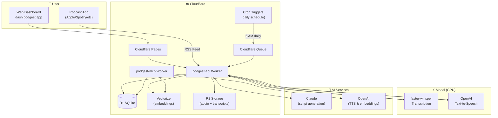

# Podgest

> **Your personal AI podcast digest - delivered daily to your favorite podcast app**

Podgest transforms your podcast subscriptions into personalized daily audio digests. Subscribe to unlimited podcasts, and each morning receive a professionally narrated summary of what matters most - delivered directly to Apple Podcasts, Spotify, or any podcast app via your personal RSS feed.

**Live at [dash.podgest.app](https://dash.podgest.app)**

---

## Architecture



---

## Key Features

| Feature | Description |
|---------|-------------|
| **🎧 Personal RSS Feed** | Subscribe in any podcast app - Apple Podcasts, Spotify, Overcast, etc. |
| **⏱️ Configurable Length** | Choose digest length from 5-20 minutes based on your commute |
| **🕐 Custom Schedule** | Pick your delivery time and timezone (6 AM default) |
| **📡 Any Podcast RSS** | Add any podcast via RSS URL or browse popular feeds |
| **🔗 ListenNotes Integration** | Import your Listen Later playlist - auto-detects individual podcasts |
| **🎯 Smart Prioritization** | Less frequent podcasts (weekly shows) get priority over daily ones |
| **🔐 BYOK (Bring Your Own Keys)** | Use your own OpenAI and Anthropic API keys |
| **🔒 Encrypted Storage** | API keys encrypted at rest with AES-256-GCM |
| **🧠 Semantic Memory** | All transcripts embedded in Cloudflare Vectorize - search and query across your entire podcast history |
| **👥 Multi-tenant** | Each user has isolated data and personalized digests |
| **🎙️ MCP Server** | Query your podcast knowledge via Claude Desktop or Cursor |

---

## How It Works

1. **Subscribe** - Add your favorite podcasts via RSS URL in the dashboard
2. **Configure** - Set your preferred digest length (5-20 min), delivery time, and timezone  
3. **Add API Keys** - Provide your OpenAI and Anthropic keys (encrypted and stored securely)
4. **Listen** - Add your personal RSS feed to any podcast app
5. **Enjoy** - Wake up to a personalized audio digest every morning

### Daily Pipeline

```
6:00 AM (your timezone)
    │
    ▼
┌─────────────┐     ┌─────────────┐     ┌─────────────┐
│  Poll RSS   │────▶│ Transcribe  │────▶│  Extract    │
│   Feeds     │     │   (Modal)   │     │   Topics    │
└─────────────┘     └─────────────┘     └─────────────┘
                                               │
    ┌──────────────────────────────────────────┘
    │
    ▼
┌─────────────┐     ┌─────────────┐     ┌─────────────┐
│  Generate   │────▶│  Text-to-   │────▶│  Publish    │
│   Script    │     │   Speech    │     │  to RSS     │
│  (Claude)   │     │ (OpenAI)    │     │             │
└─────────────┘     └─────────────┘     └─────────────┘
```

---

## Tech Stack

| Component | Technology |
|-----------|------------|
| **Frontend** | React + TypeScript + Tailwind (Cloudflare Pages) |
| **API** | Cloudflare Workers (TypeScript) |
| **Database** | Cloudflare D1 (SQLite) |
| **Storage** | Cloudflare R2 (audio via cdn.podgest.app, private transcripts) |
| **Vector Search** | Cloudflare Vectorize |
| **Scheduling** | Cloudflare Cron Triggers + Queues |
| **Transcription** | Modal (faster-whisper on GPU) |
| **Script Generation** | Claude (Anthropic) |
| **Text-to-Speech** | OpenAI TTS |
| **Auth** | Better Auth (Google sign-in, D1-backed sessions) |

---

## Project Structure

```
podgest/
├── apps/
│   ├── web/                        # React dashboard (Cloudflare Pages)
│   │   └── src/
│   │       ├── pages/
│   │       │   ├── Settings.tsx     # API keys, digest prefs, manual generation
│   │       │   ├── Subscriptions.tsx # Podcast management
│   │       │   └── onboarding/      # First-time user setup
│   │       └── lib/
│   │           └── auth.ts          # Better Auth client
│   │
│   ├── worker/
│   │   └── podgest-api/             # Main API (Cloudflare Worker)
│   │       └── src/
│   │           ├── index.ts         # API endpoints, digest pipeline, RSS feed, cron
│   │           ├── auth.ts          # Better Auth config (Google, D1, shared cookies)
│   │           └── user-keys.ts     # API key encryption/validation
│   │
│   └── mcp-server/                  # MCP Server (Cloudflare Worker)
│       └── src/
│           └── index.ts             # MCP protocol handler
│
├── modal/
│   ├── transcribe.py                # GPU transcription (faster-whisper)
│   └── tts.py                       # Text-to-speech generation
│
├── migration/
│   ├── d1_schema.sql                # D1 (SQLite) schema
│   └── better_auth_schema.sql       # Better Auth tables
│
├── docs/
│   └── IMPLEMENTATION.md            # Detailed design docs & implementation plan
│
└── .cursor/
    └── agents/                      # Reusable Cursor agents
        ├── security.md              # Security review agent
        ├── verification.md          # System verification agent
        └── ui.md                    # UI testing agent
```

## Getting Started

### Prerequisites

- Node.js 18+
- pnpm
- Cloudflare account (Workers + Pages + D1 + R2 + Vectorize)
- Modal account (for GPU transcription)
- Google OAuth client (for Better Auth sign-in)

### Environment Variables

Worker secrets (set via `wrangler secret put`):

| Secret | Description |
|--------|-------------|
| `API_KEY_ENCRYPTION_KEY` | AES-256 key for encrypting user API keys |
| `ADMIN_API_KEY` | Admin endpoint authentication |
| `BETTER_AUTH_SECRET` | Better Auth session signing secret |
| `GOOGLE_CLIENT_ID` / `GOOGLE_CLIENT_SECRET` | Google OAuth client for sign-in |

### Development

```bash
# Install dependencies
pnpm install

# Run web dashboard locally
pnpm --filter web dev

# Deploy API worker
cd apps/worker/podgest-api && npx wrangler deploy

# Deploy web dashboard
cd apps/web && npm run build && npx wrangler pages deploy dist --project-name=podgest-web
```

## Documentation

- [Implementation Plan & Design Docs](docs/IMPLEMENTATION.md) - Detailed architecture, design decisions, roadmap
- [Security Agent](.cursor/agents/security.md) - Reusable security review configuration

---

## License

Private - All rights reserved.
